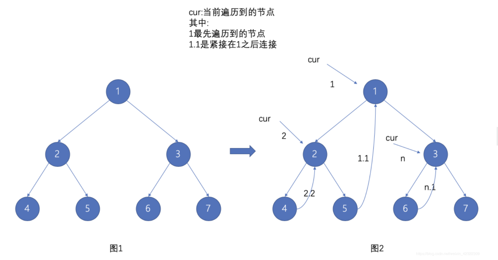

- *Morris 遍历,一篇论文中提到的算法
  可以在线性时间内，只占用常数空间来实现前序遍历。这种方法由 J. H. Morris 在 1979 年的论文「Traversing Binary Trees Simply and Cheaply」中首次提出，因此被称为 Morris 遍历。
- 利用二叉树中的叶子节点null指针指向下一个需要遍历的节点
        临时创建一个链接,从左子节点的最右子节点的right指向根节点,后续再断开临时链接
- 核心通用思路(三种遍历方式不同之处仅在于访问节点数据的时机):
  1. 如果根节点的左子节点存在,一直遍历寻找左子节点的最右叶子节点(C右)
     结束条件(a.right指针为null.没有建立临时链接 b.right指针指向根节点，已经建立了临时链接）
        1.1如果(C右)节点不存在，则左子节点本身就是最右叶子节点(C右)
        1.2如果(C右)节点不存在,则(C右)节点right(原本指针为null)指向根节点，创建临时链接.
        然后遍历根节点的左子节点(根节点重新指向根节点的左子节点)
        <p>
  2. 如果根节点的左子节点不存在,继续遍历根节点的右节点
  3.断开临时链接
        针对1而言如果根节点的左子节点存在,一直遍历寻找左子节点的最右叶子节点(C右)，
        如果C右节点发现right指针指向根节点本身一样时(临时链接建立的指向),那么断开这个临时链接,
        然后继续遍历根节点的右子节点(左子树已经遍历完成了)（根节点重新指向根节点的右子节点)
        <p>
        最后二叉树的最右叶子节点最后遍历
        <p>
  根节点会遍历两次左子节点,第一次建立指向自身的临时链接,第二次断开临时链接
  
- 时间复杂度和空间复杂度分析
        <p>
        时间复杂度O(n),耗时也不是最佳的，相比其他非递归遍历算法而言
        空间复杂度O(1)为常量，这个是最大特色，
- 缺点:虽然遍历结束时二叉树结构不变，但是遍历过程中修改了二叉树的结构，线程不安全
  ```java
  /**
  * 通用代码
  * 时间复杂度O(n)
  * 空间复杂度O(1)
  */
  private void preorderTraversalForMorris(List<Integer> result, TreeNode treeNode) {
          if (null == treeNode) {
              return;
          }
          TreeNode root = treeNode;
          TreeNode cur;
          while (null != root) {
  
              cur = root.left;
              //左子节点存在
              if (null != cur) {
                  //如果根节点的左子节点存在,一直遍历寻找左子节点的最右叶子节点(C右)
                  //结束条件(a.right指针为null.没有建立临时链接 b.right指针指向根节点，已经建立了临时链接）
                  while (null != cur.right && cur.right != root) {
                      cur = cur.right;
                  }
                  if (null == cur.right) {
                      //right指针为null.没有建立临时链接
                      //节点right(原本指针为null)指向根节点，创建临时链接
                      cur.right = root;
                      root = root.left;
                      continue;
                  } else {
                      //right指针指向根节点，已经建立了临时链接
                      //断开到根节点的这个临时链接
                      cur.right = null;
                  }
              } else {
                  //左子节点不存在
              }
              root = root.right;
          }
      }
  ```
- 前序遍历
  针对前序遍历访问数据时机:
        根节点存在左子节点时建立链接时访问根节点数据
        根节点不存在左子节点时(根节点本身就是上一层的左节点)访问节点数据
  ```java
  /**
       * <p>
       * 针对前序遍历访问数据时机:
       * 根节点存在左子节点时建立链接时访问根节点数据
       * 根节点不存在左子节点时(根节点本身就是上一层的左节点)访问节点数据
       *  时间复杂度O(n)
       *  空间复杂度O(1)
       */
      private void preorderTraversalForMorris(List<Integer> result, TreeNode treeNode) {
          if (null == treeNode) {
              return;
          }
          TreeNode root = treeNode;
          TreeNode cur;
          while (null != root) {
              
              cur = root.left;
              //左子节点存在
              if (null != cur) {
                  //如果根节点的左子节点存在,一直遍历寻找左子节点的最右叶子节点(C右)
                  //结束条件(a.right指针为null.没有建立临时链接 b.right指针指向根节点，已经建立了临时链接）
                  while (null != cur.right && cur.right != root) {
                      cur = cur.right;
                  }
                  if (null == cur.right) {
                      //right指针为null.没有建立临时链接
                      result.add(root.val);
                      //节点right(原本指针为null)指向根节点，创建临时链接
                      cur.right = root;
                      root = root.left;
                      continue;
                  } else {
                      //right指针指向根节点，已经建立了临时链接
                      //断开到根节点的这个临时链接
                      cur.right = null;
                  }
              } else {
                  //左子节点不存在
                  result.add(root.val);
              }
              root = root.right;
          }
      }
  ```
- 中序遍历
- 后序遍历
- 资料
  [前序遍历Morris解法](https://leetcode.cn/problems/binary-tree-preorder-traversal/solution/leetcodesuan-fa-xiu-lian-dong-hua-yan-shi-xbian-2/)