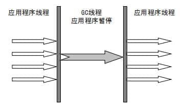
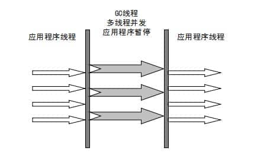
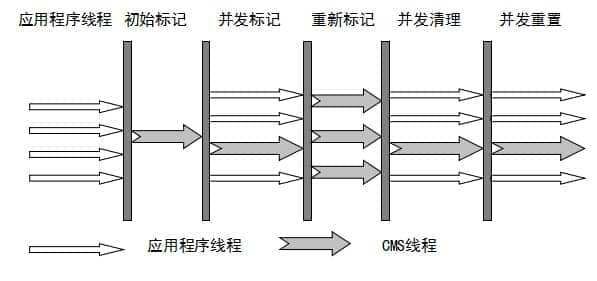

- 收集算法是内存回收的方法论，垃圾收集器就是内存回收的具体实现
  关于该如何选择垃圾回收器
  根据具体应用场景选择适合自己的垃圾收集器，没有放之四海而皆准的垃圾回收器,不然也不会有这么多的垃圾回收器了。
- Stop the Word
  gc线程工作的时候，其他所有工作线程必须暂停下来--->整个世界都静止了
- gc安全点
- 垃圾回收器中的并行和并发概念
  id:: 62a549aa-9cf3-481a-b3fd-57c6d9195592
  和线程理解下的并发，并行不太一样
  并行(Parallel)：指多条垃圾收集线程并行工作，但此时用户线程仍然处于暂停状态。
  并发(Concurrent)：指用户线程与垃圾收集线程同时执行（但不一定是并行，可能会交替执行），用户程序在继续运行，而垃圾收集器运行在另一个 CPU 上。
  单行垃圾回收器:Serial 收集器,Serial Old 收集器
  并行垃圾回收器：ParNew 收集器,Parallel Old 收集器,Parallel Scavenge 收集器
  并发垃圾回收器:CMS,G1,ZGC
- Serial 收集器
  定义:单线程gc收集器
  特点:只会使用一条垃圾收集线程去完成垃圾收集工作，更重要的是它在进行垃圾收集工作的时候必须暂停其他所有的工作线程（ "Stop The World" ），直到它收集结束。
  江湖地位:Serial（串行）收集器是最基本、历史最悠久的垃圾收集器了
  新生代采用标记-复制算法，老年代采用标记-整理算法。
  TODO:cj 整理表格
  缺点:
  必须要stop the word，效率低
  优点:简单单线程效率高
  适用场景:运行在 Client 模式下的虚拟机来说也许是个不错的选择
  
- ParNew 收集器
  定义:除了使用多线程进行垃圾收集外，其余行为（控制参数、收集算法、回收策略等等）和 Serial 收集器完全一样。
  江湖地位:ParNew 收集器其实就是 Serial 收集器的多线程版本
  并行垃圾回收器 ((62a549aa-9cf3-481a-b3fd-57c6d9195592)) 
  新生代采用标记-复制算法，老年代采用标记-整理算法。
  缺点:
  必须要stop the word，
  优点:相比Serial收集器效率提高
  收集器搭配使用:除了 Serial 收集器外，只有它能与 CMS 收集器（真正意义上的并发收集器，后面会介绍到）配合工作。
  
- Parallel Scavenge 收集器
  Parallel Scavenge 收集器也是多线程收集器，它看上去几乎和 ParNew 都一样。
  并行垃圾回收器 ((62a549aa-9cf3-481a-b3fd-57c6d9195592)) 
  和ParNew垃圾收集器的区别是什么？
  **Parallel Scavenge 收集器设计核心关注点是吞吐量（高效率的利用 CPU），而其他垃圾回收器(ParNew,CMS)核心关注点是减少Stop the World停顿时间。**
  吞吐量就是 CPU 中用于运行用户代码的时间与 CPU 总消耗时间的比值。
  
  新生代采用标记-复制算法，老年代采用标记-整理算法。
  ```
  -XX:+UseParallelGC
  
      使用 Parallel Scavenge收集器
  
    -XX:+UseParallelOldGC
  
      使用 Parallel Old收集器
  如果指定了-XX:+UseParallelGC 参数，则默认指定了-XX:+UseParallelOldGC
  ```
  ((62a559d4-27ed-4e29-8986-a9f261be6713)) 
  
  
  这是 JDK1.8 默认收集器(但是jdk8下，当主要关注点在减少stop the world停顿时间的应用程序而言,jdk8主要选择CMS垃圾回收器)
  
  使用 java -XX:+PrintCommandLineFlags -version 命令查看
  ```shell
  -XX:InitialHeapSize=262921408 -XX:MaxHeapSize=4206742528 -XX:+PrintCommandLineFlags -XX:+UseCompressedClassPointers -XX:+UseCompressedOops -XX:+UseParallelGC
  java version "1.8.0_211"
  Java(TM) SE Runtime Environment (build 1.8.0_211-b12)
  Java HotSpot(TM) 64-Bit Server VM (build 25.211-b12, mixed mode)
  ```
  JDK1.8 默认使用的是 Parallel Scavenge + Parallel Old，如果指定了-XX:+UseParallelGC 参数，则默认指定了-XX:+UseParallelOldGC，可以使用-XX:-UseParallelOldGC 来禁用该功能
-
- Serial Old 收集器
  Serial 收集器的老年代版本，它同样是一个单线程收集器。
  它主要有两大用途：一种用途是在 JDK1.5 以及以前的版本中与 Parallel Scavenge 收集器搭配使用，另一种用途是作为 CMS 收集器的后备方案。
- Parallel Old 收集器
  Parallel Scavenge 收集器的老年代版本。使用多线程和“标记-整理”算法。
  在注重吞吐量以及 CPU 资源的场合，都可以优先考虑 Parallel Scavenge 收集器和 Parallel Old 收集器。
- CMS 收集器(Concurrent Mark Sweep)
  并发标记清除垃圾回收器
  核心设计目的:降低Stop the Word停顿时间
  江湖地位: HotSpot 虚拟机第一款真正意义上的并发收集器，它第一次实现了让垃圾收集线程与用户线程（基本上）同时工作。
   ((62a549aa-9cf3-481a-b3fd-57c6d9195592))
  基于“标记-清除”算法实现
  算法主要步骤
  1. 初始标记： 暂停所有的其他线程，并记录下直接与 root 相连的对象，速度很快 ；(STW)
  2. 并发标记： 同时开启 GC 和用户线程，用一个闭包结构去记录可达对象。但在这个阶段结束，这个闭包结构并不能保证包含当前所有的可达对象。因为用户线程可能会不断的更新引用域，所以 GC 线程无法保证可达性分析的实时性。所以这个算法里会跟踪记录这些发生引用更新的地方
  3. 重新标记： 重新标记阶段就是为了修正并发标记期间因为用户程序继续运行而导致标记产生变动的那一部分对象的标记记录，这个阶段的停顿时间一般会比初始标记阶段的时间稍长，远远比并发标记阶段时间短(STW)
  4. 并发清除： 开启用户线程，同时 GC 线程开始对未标记的区域做清扫。
   
  优点:
  并发收集
  低停顿
  缺点:
  1. 对 CPU 资源敏感
  2. 无法处理浮动垃圾
  3. 它使用的回收算法-“标记-清除”算法会导致收集结束时会有大量空间碎片产生.
- G1 收集器(Garbage-First)
  G1 (Garbage-First) 是一款面向服务器的垃圾收集器
  核心设计目标：主要针对配备多颗处理器及大容量内存的机器. 以极高概率满足 GC 停顿时间要求的同时,还具备高吞吐量性能特征
  特征:
  1. 并发垃圾回收器:G1 能充分利用 CPU、多核环境下的硬件优势，使用多个 CPU（CPU 或者 CPU 核心）来缩短 Stop-The-World 停顿时间。
  部分其他收集器原本需要停顿 Java 线程执行的 GC 动作，G1 收集器仍然可以通过并发的方式让 java 程序继续执行。
  2. 分代收集：G1可以不需要其他收集器配合就能独立管理整个 GC 堆，但是还是保留了分代的概念。
  3. 空间整合:G1 从整体来看是基于“标记-整理”算法实现的收集器；从局部上来看是基于“标记-复制”算法实现的。
  4. 可预测的停顿：这是 G1 相对于 CMS 的另一个大优势，降低停顿时间是 G1 和 CMS 共同的关注点，但 G1 除了追求低停顿外，还能建立可预测的停顿时间模型，能让使用者明确指定在一个长度为 M 毫秒的时间片段内。
  G1 收集器在后台维护了一个优先列表，每次根据允许的收集时间，优先选择回收价值最大的 Region(这也就是它的名字 Garbage-First 的由来) 
  (应用程序可以指定最长停顿时间，这个就比较牛逼了)
  主要步骤:
  1. 初始标记
  2. 并发标记
  3. 最终标记
  4. 筛选回收
- ZGC 收集器
  优化
  着色指针
- 资料
  [美团技术团队-新一代垃圾回收器ZGC的探索与实践](https://tech.meituan.com/2020/08/06/new-zgc-practice-in-meituan.html)