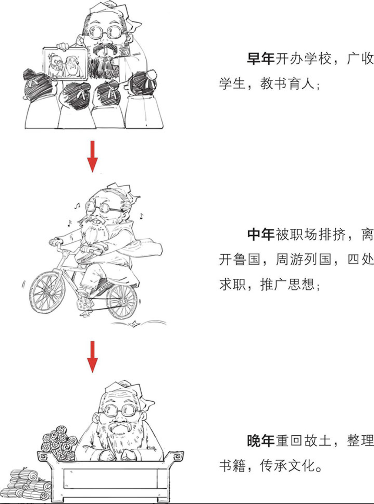

- 孔圣人,儒家创始人,中国历史上影响力最大的文化人物
- 孔子名称:孔子，子姓，孔氏，叫孔丘(说是出生在尼丘山，所以叫孔丘)，字仲尼(家里排行老二,伯、仲、叔、季)
- 孔子的人生理想:在春秋这个礼崩乐坏的时代，恢复周朝的礼乐制度
  希望通过自己的思想实现人生理想。
- 生平:春秋时期鲁国人
	- 生平
		- 早年开办学校，广收门徒，教书育人。
		  以前只有贵族才有资格学习，平民是没有资格学习的，
		  孔子有教无类
		- 中年被职场排挤,离开鲁国，周游列国,四处求职，推广思想
		- 晚年重回故土,整理书籍，传承文化
		  
		  
	- 孔子一生主要做了什么哪些事情？
		- 终生学习者
		- 1
		- 2
		- 3
		-