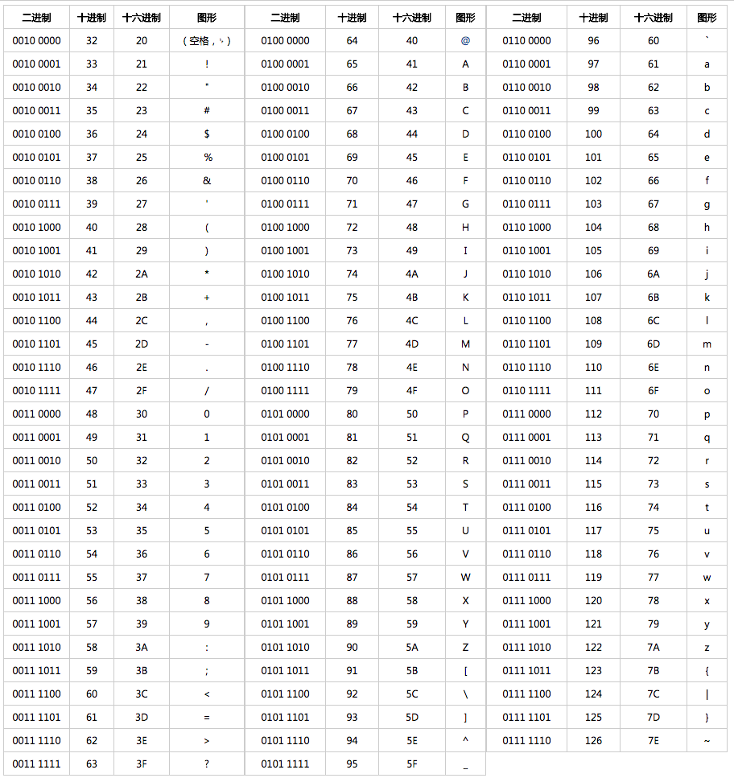

- 计算机只能存储二进制的数据，那英文、汉字、表情等字符应该如何存储呢？
  将这些字符和二进制的数据一一对应起来，有一套映射规则,这套规则就是字符集
  "字符编码":字符对应二进制数据的过程
  “字符解码”:二进制数据解析成字符的过程
- 常见的字符集有 ASCII、GB2312、GBK、UTF-8
- 不同的字符集的主要区别在于：
  1. 可以表示的字符范围
  2. 编码方式
- ASCII(American Standard Code for Information Interchange，美国信息交换标准代码)
  为什么 ASCII 字符集没有考虑到中文等其他字符呢？
  因为计算机是美国人发明的，当时，计算机的发展还处于比较雏形的时代，还未在其他国家大规模使用。因此，美国发布 ASCII 字符集的时候没有考虑兼容其他国家的语言。
  
  ASCII字符集至今为止共定义了 128 个字符，其中有 33 个控制字符（比如回车、删除）无法显示。
  一个 ASCII 码长度是一个字节也就是 8 个 bit。最高位是 0 仅仅作为校验位，其余 7 位使用 0 和 1 进行组合，所以，ASCII 字符集可以定义 128（2^7）个字符。
  
- GB2312
  一种对汉字比较友好的字符集，共收录 6700 多个汉字，基本涵盖了绝大部分常用汉字。不过，GB2312 字符集不支持绝大部分的生僻字和繁体字。
  对于英语字符，GB2312 编码和 ASCII 码是相同的，1 字节编码即可。对于非英字符，需要 2 字节编码。
- GBK
  GBK 字符集可以看作是 GB2312 字符集的扩展，兼容 GB2312 字符集，共收录了 20000 多个汉字。
  GBK 中 K 是汉语拼音 Kuo Zhan（扩展）中的“Kuo”的首字母。
- GB18030
  GB18030 完全兼容 GB2312 和 GBK 字符集，纳入中国国内少数民族的文字，且收录了日韩汉字，是目前为止最全面的汉字字符集，共收录汉字 70000 多个。
- Unicode & UTF-8编码
- 乱码问题
  使用错误的编码方式查看一个包含字符的文件就会产生乱码现象。
  举例:
  比如说你使用 UTF-8 编码方式打开 GB2312 编码格式的文件就会出现乱码。示例：“牛”这个汉字 GB2312 编码后的十六进制数值为 “C5A3”，而 “C5A3” 用 UTF-8 解码之后得到的却是 “ţ”。