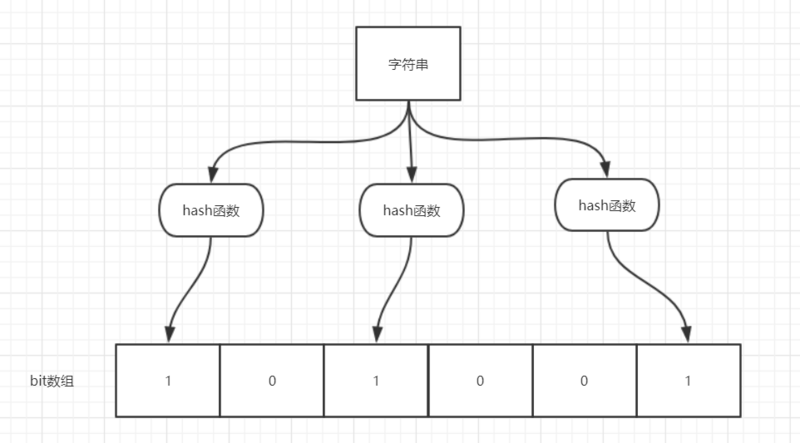

- 数据结构：布隆过滤器（Bloom Filter）是一个叫做 Bloom 的老哥于 1970 年提出的。我们可以把它看作由二进制向量（或者说位数组）和一系列随机映射函数（哈希函数）两部分组成的数据结构。
  作用:通过它我们可以非常方便地判断一个给定数据是否存在于海量数据中。
  布隆过滤器描述：把所有可能存在的请求的值都存放在布隆过滤器中，当用户请求过来，先判断用户发来的请求的值是否存在于布隆过滤器中。不存在的话，直接返回请求参数错误信息给客户端，存在的话才会走下面的流程。
- 布隆过滤器原理: 比特位组数组+N组哈希函数
  一个元素加入布隆过滤器中的过程分析：
  1. 使用布隆过滤器中的哈希函数对元素值进行计算，得到哈希值（有几个哈希函数得到几个哈希值）。
  2. 根据得到的哈希值，在位数组中把对应下标的值置为 1。
   
  判断一个元素是否存在于布隆过滤器过程分析：
  1. 对给定元素进行哈希计算；
  2. 得到值之后判断位数组中的每个元素是否都为 1，如果值都为 1，那么说明这个值大概率在布隆过滤器中，如果存在一个值不为 1，说明该元素一定不在布隆过滤器中。
  一定会出现这样一种情况：不同的字符串可能哈希出来的位置相同。
- 解决方案:可以适当增加位数组大小或者调整我们的哈希函数来降低概率
  缺点：
  1. 存在一定程度上的误判,比如不存在的key通过校验，但是绝对不允许存在的key不通过校验。
  2. 删除比较困难,如果数据会动态删除则不适合用布隆过滤器处理
  内存占用量计算：1亿条数据，占用内存 100000000/8/1024/1024=11M
- 布隆过滤器使用场景
  1. 判断给定数据是否存在：
  比如判断一个数字是否存在于包含大量数字的数字集中（数字集很大，5 亿以上！）、
   防止缓存穿透（判断请求的数据是否有效避免直接绕过缓存请求数据库）等等、
  邮箱的垃圾邮件过滤、
  黑名单功能等等。
  2. 去重：比如爬给定网址的时候对已经爬取过的 URL 去重。