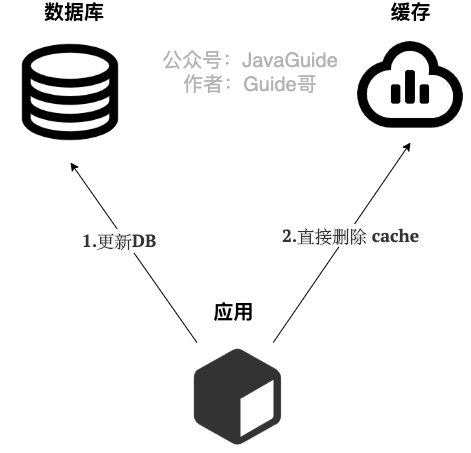
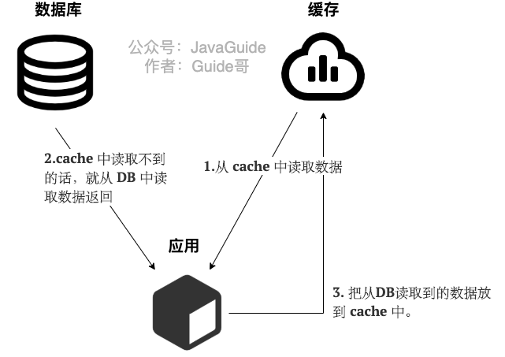

- 缓存和其他的场景
  业务开发场景中:缓存redis和DB
  系统开发场景中:内存缓存和磁盘，CPU高速缓存和内存
  下面主要是针对redis缓存和DB的读写谈论。
- 这3 种缓存读写策略各有优劣，不存在最佳，需要我们根据具体的业务场景选择更适合的。
- Cache Aside Pattern（旁路缓存模式）
  Cache Aside Pattern 是我们平时日常业务开发中最常使用的缓存读写模式，比较适合读请求比较多的场景。
  Cache Aside Pattern 中服务端需要同时维系 DB 和 cache，并且是以 DB 的结果为准。
  下面我们来看一下这个策略模式下的缓存读写步骤。
  写 ：
  1. 先更新 DB
  2. 然后直接删除 cache 。
  
  读:
  1. 从 cache 中读取数据，读取到就直接返回
  2. cache中读取不到的话，就从 DB 中读取数据返回
  3. 再把数据放到 cache 中。
  
  
  [[redis缓存和数据库一致性问题]]
  
  Cache Aside Pattern 的缺陷。
  缺陷1：首次请求数据一定不在 cache 的问题
  解决办法：可以将热点数据可以提前放入cache 中。
  缺陷2：写操作比较频繁的话导致cache中的数据会被频繁被删除，这样会影响缓存命中率 。
- Read/Write Through Pattern（读写穿透）
  Read/Write Through Pattern 中服务端把 cache 视为主要数据存储，从中读取数据并将数据写入其中。cache 服务负责将此数据读取和写入 DB，从而减轻了应用程序的职责。
  这种缓存读写策略小伙伴们应该也发现了在平时在开发过程中非常少见。抛去性能方面的影响，大概率是因为我们经常使用的分布式缓存 Redis 并没有提供 cache 将数据写入DB的功能。
  写（Write Through）:
  1. 先查 cache，cache 中不存在，直接更新 DB。
  2. cache 中存在，则先更新 cache，然后 cache 服务自己更新 DB（同步更新 cache 和 DB）。
  
  读(Read Through)：
  1. 从 cache 中读取数据，读取到就直接返回 。
  2. 读取不到的话，先从 DB 加载，写入到 cache 后返回响应。
  Read-Through Pattern 实际只是在 Cache-Aside Pattern 之上进行了封装。在 Cache-Aside Pattern 下，发生读请求的时候，如果 cache 中不存在对应的数据，是由客户端自己负责把数据写入 cache，而 Read-Through Pattern 则是 cache 服务自己来写入缓存的，这对客户端是透明的。
- Write Behind Pattern（异步缓存写入）