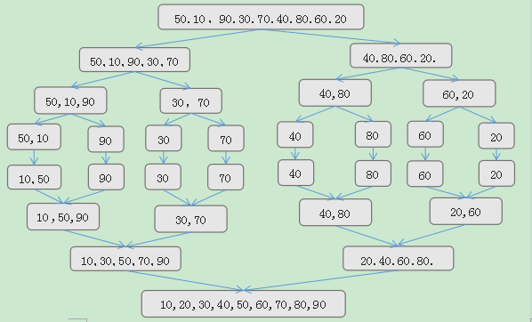
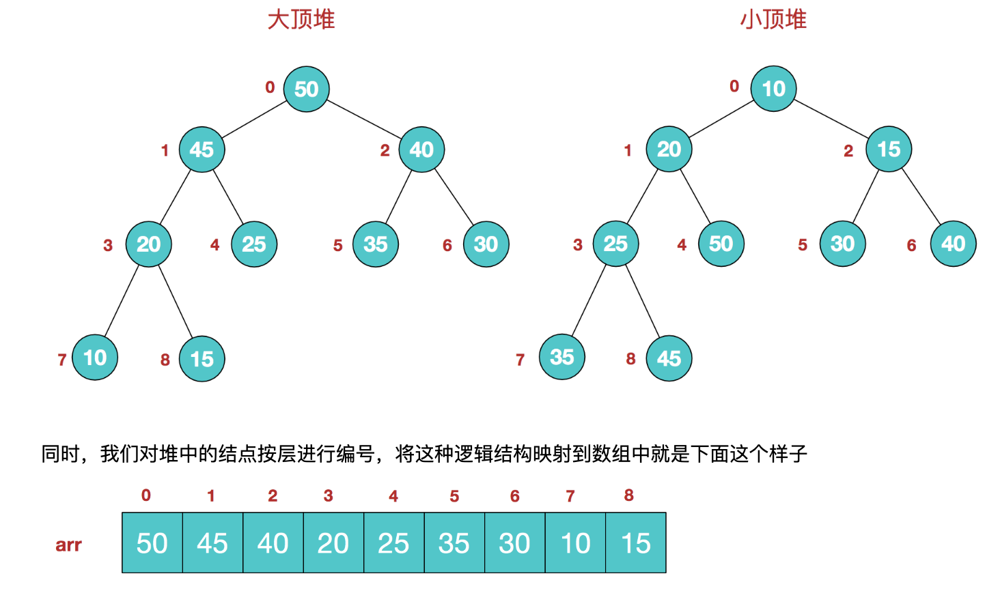

- 上来就上总结图
  {:height 681, :width 1102}
  稳定：如果a原本在b前面，而a=b，排序之后a仍然在b的前面。
  不稳定：如果a原本在b的前面，而a=b，排序之后 a 可能会出现在 b 的后面。
  分类
  比较类排序：通过比较来决定元素间的相对次序，
  其时间复杂度不能突破O(nlogn)，因此也称为非线性时间比较类排序。
  非比较类排序：不通过比较来决定元素间的相对次序，
  它可以突破基于比较排序的时间下界，以线性时间运行，因此也称为线性时间非比较类排序
  
  
-
- 冒泡排序（Bubble Sort）
  算法核心思想:不断比较相邻元素,如果第一个元素比第二个元素大，就交换他们的位置。
  
  --->名称由来:这个算法的名字由来是因为越小的元素会经由交换慢慢“浮”到数列的顶端。
  时间复杂度分析
  空间复杂度分析 
  稳定性分析
  
- 选择排序(Selection Sort)
  算法核心思想：数组分为待排序区和有序区,每次从待排序区取出最大元素放到有序区队尾
  最直观的排序
  时间复杂度分析
  空间复杂度分析
  稳定性分析
  为什么选择排序不稳定?
  
- 插入排序(Insertion Sort)
  算法核心思想:构建有序序列,待排序元素从后往前与有序序列比较,插入到合适位置。
  时间复杂度分析
  空间复杂度分析
  稳定性分析
  
- 希尔排序(Shell Sort)
  1959年Shell发明，第一个突破O(n2)的排序算法，简单插入排序的改进版,又称“缩小增量排序”（Diminishing Increment Sort）
  算法核心思想:将整个待排序的序列分割成为若干子序列分别进行直接插入排序
  具体算法描述:
  1. 选择一个增量序列t1，t2，…，tk，其中ti>tj，tk=1；(增量序列最后一个必须是1)
  2. 按增量序列个数k，对序列进行k 趟插入排序；
  3. 每趟排序，根据对应的增量ti，将待排序列分割成若干长度为m 的子序列，分别对各子表进行直接插入排序。
  仅增量因子为1 时，整个序列作为一个表来处理，表长度即为整个序列的长度。
  
  最后一轮序列就“基本有序”状态了。
  
  增量序列:如何选择增量序列是希尔排序的关键
  希尔增量:{n/2,(n/2)/2...1}，称为增量序列,常用增量序列,但不是最高效的。
  
  时间复杂度分析
  空间复杂度分析
  稳定性分析
  
  
- 归并排序(Merge Sort)
  算法核心:分治法,将已有序的子序列合并，得到完全有序的序列
  
  算法实现可以采用递归方式
  两路归并:将两个有序表合并成一个有序表
  多路归并:将多个有序表合并成一个有序表
  
  时间复杂度分析
  空间复杂度分析:O(n),需要额外的空间
  稳定性分析
   
  
- 快速排序(Quick Sort)
  
  算法核心思想:分治法把序列分成左右两个序列,其中左序列的元素都比右序列的元素小，分治法递归处理完所有子序列。
  基准数:比基准值小的在左边序列，比基准值大的在右边序列
  快速排序是在冒泡排序的基础上改进而来的
  
- 堆排序
  利用堆数据结构设计的一种排序算法
	- 堆的性质: ((62976266-b4bc-4324-83dd-c8abf96895ba))
	- 算法核心思想:待排序序列构建一个初始堆(例如大顶堆),将堆顶元素和待排序序列最后位置的元素交换,然后再调整堆,然后再不断交换堆顶元素和待排序序列元素交换位置,直到排序完成。
	- 算法描述
	  1. 将初始待排序关键字序列(R1,R2….Rn)构建成大顶堆，此堆为初始的无序区。
	  2. 将堆顶元素R[1]与最后一个元素R[n]交换，此时得到新的无序区(R1,R2,……Rn-1)和新的有序区(Rn),且满足R[1,2…n-1]<=R[n]；
	  3. 由于交换后新的堆顶R[1]可能违反堆的性质，因此需要对当前无序区(R1,R2,……Rn-1)调整为新堆，然后再次将R[1]与无序区最后一个元素交换，得到新的无序区(R1,R2….Rn-2)和新的有序区(Rn-1,Rn)。不断重复此过程直到有序区的元素个数为n-1，则整个排序过程完成。
	- 算法实现
	  第一次构建大顶堆，也是一个不断调整堆的过程，满足堆性质。
	  
	  一般升序采用大顶堆(堆顶是最大元素)，降序采用小顶堆(堆顶是最小元素)
	  
	  节点和左右子节点下标之间的关系 节点下标arr[i],左右子节点下标arr[2i+1],arr[2i+2]
	  该数组从逻辑上讲就是一个堆结构，我们用简单的公式来描述一下堆的定义就是：
	  大顶堆：arr[i] >= arr[2i+1] && arr[i] >= arr[2i+2]
	  小顶堆：arr[i] <= arr[2i+1] && arr[i] <= arr[2i+2]
	  
	  
	   
	  
-
-
-
- 计数排序(Counting Sort)
  计数排序不是基于比较的排序算法
  算法核心思想:其核心在于将输入的数据值转化为键存储在额外开辟的数组空间中。
  算法要求:计数排序要求输入的数据必须是有确定范围的整数。
  时间复杂度分析
  空间复杂度分析
  计数排序是一个稳定的排序算法。当输入的元素是 n 个 0到 k 之间的整数时，时间复杂度是O(n+k)，空间复杂度也是O(n+k)，其排序速度快于任何比较排序算法
  适用场景:当k不是很大并且序列比较集中时，计数排序是一个很有效的排序算法。
  
- 桶排序
- 基数排序
- java sort方法研究
  里面有各种优化
  java sort方法有快速排序的优化变种,
  分情况使用不同的排序算法
- 资料
  [10大经典排序算法(动图演示),优点动画演示缺点没有时间复杂度分析](https://www.cnblogs.com/onepixel/p/7674659.html)