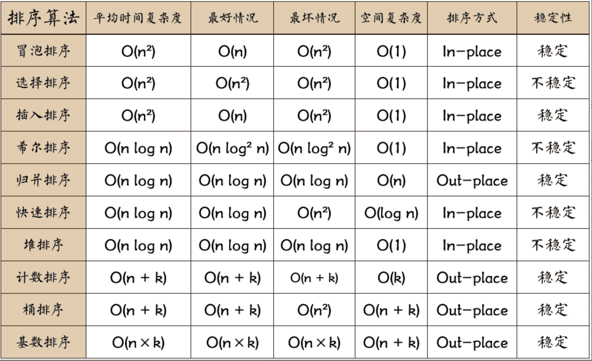
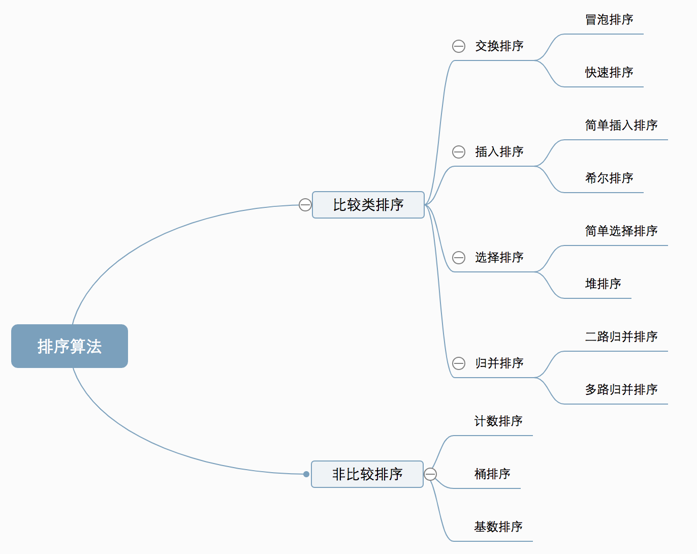
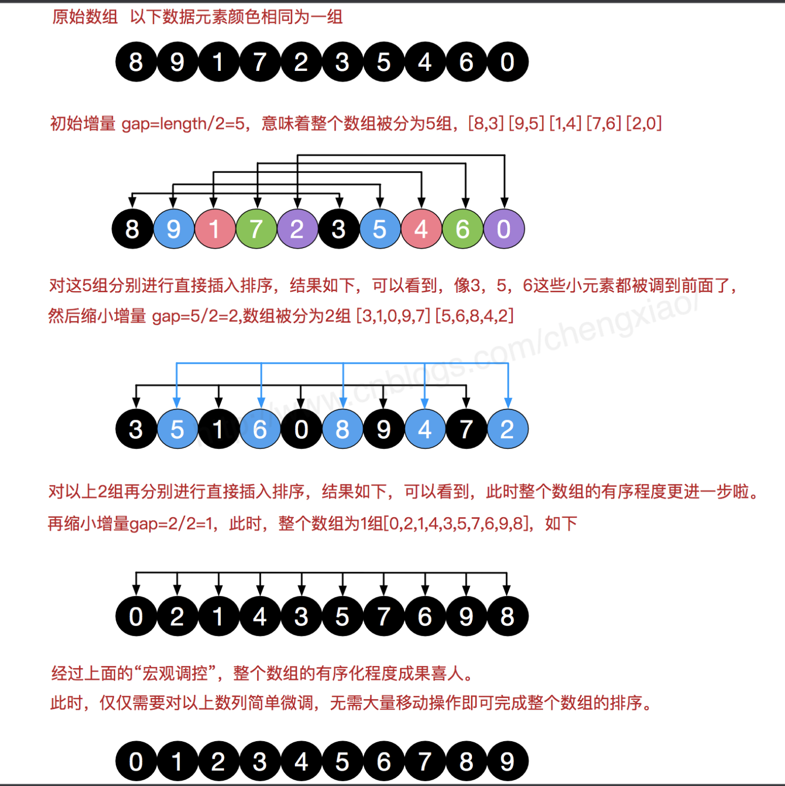

- 上来就上总结图
  
  稳定：如果a原本在b前面，而a=b，排序之后a仍然在b的前面。
  不稳定：如果a原本在b的前面，而a=b，排序之后 a 可能会出现在 b 的后面。
  分类
  比较类排序：通过比较来决定元素间的相对次序，
  其时间复杂度不能突破O(nlogn)，因此也称为非线性时间比较类排序。
  非比较类排序：不通过比较来决定元素间的相对次序，
  它可以突破基于比较排序的时间下界，以线性时间运行，因此也称为线性时间非比较类排序
  
  
-
- 冒泡排序（Bubble Sort）
  算法核心思想:不断比较相邻元素,如果第一个元素比第二个元素大，就交换他们的位置。
  
  --->名称由来:这个算法的名字由来是因为越小的元素会经由交换慢慢“浮”到数列的顶端。
  时间复杂度分析
  空间复杂度分析 
  稳定性分析
  
- 选择排序(Selection Sort)
  算法核心思想：数组分为待排序区和有序区,每次从待排序区取出最大元素放到有序区队尾
  最直观的排序
  时间复杂度分析
  空间复杂度分析
  稳定性分析
  为什么选择排序不稳定?
  
- 插入排序(Insertion Sort)
  算法核心思想:构建有序序列,待排序元素从后往前与有序序列比较,插入到合适位置。
  时间复杂度分析
  空间复杂度分析
  稳定性分析
  
- 希尔排序(Shell Sort)
  1959年Shell发明，第一个突破O(n2)的排序算法，简单插入排序的改进版,又称“缩小增量排序”（Diminishing Increment Sort）
  算法核心思想:将整个待排序的序列分割成为若干子序列分别进行直接插入排序,
  按序列个数k，对序列进行k 趟排序；当子序列为整个序列时,这一趟排序完成即为排序结束。
  
  希尔增量:{n/2,(n/2)/2...1}，称为增量序列,常用增量序列
  
  时间复杂度分析
  空间复杂度分析
  稳定性分析
  
  
- 归并排序
- 快速排序
- 堆排序
- 计数排序
- 桶排序
- 基数排序
- java sort方法研究
  里面有各种优化
  java sort方法有快速排序的优化变种,
  分情况使用不同的排序算法
- 资料
  [10大经典排序算法(动图演示),优点动画演示缺点没有时间复杂度分析](https://www.cnblogs.com/onepixel/p/7674659.html)