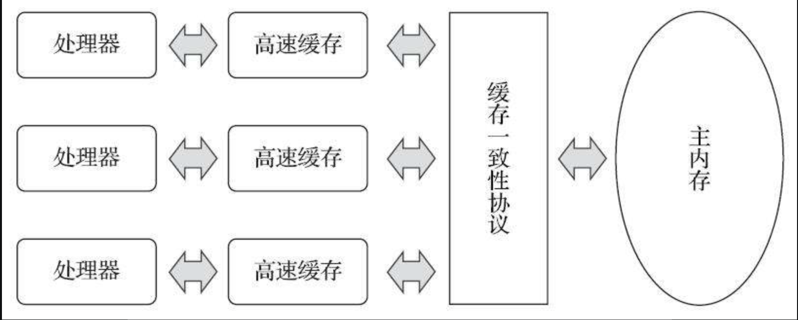

- CPU
  id:: 6299badd-eb69-4311-83f8-e55c788c01be
  问题:CPU与内存执行速度相差数量级的问题
  提高CPU执行效率
  1. CPU高速缓存
  2. 乱序执行优化（Out-Of-Order Execution）
  定义:处理器可能会对输入代码进行乱序执行（Out-Of-Order Execution）优化，处理器会在计算之后将乱序执行的结果重组，保证该结果与顺序执行的结果是一致的.
  重要性质:但并不保证程序中各个语句计算的先后顺序与输入代码中的顺序一致，因此如果存在一个计算任务依赖另外一个计算任务的中间结果，那么其顺序性并不能靠代码的先后顺序来保证。--->虚拟机指令重排序优化
  
  CPU缓存模型:解决CPU与内存执行速度相差数量级的问题
  {:height 723, :width 1102} 
  先复制一份数据到 CPU Cache 中，当 CPU 需要用到的时候就可以直接从 CPU Cache 中读取数据，当运算完成后，再将运算得到的数据写回 Main Memory 中。但是，这样存在 内存缓存不一致性的问题 ！
  
  引入了新问题:缓存一致性问题（CacheCoherence）
  问题举例:
  比如执行一个 i++操作的话，如果两个线程同时执行的话，假设两个线程从 CPU Cache 中读取的 i=1，两个线程做了 1++运算完之后再写回 Main Memory 之后 i=2，而正确结果应该是 i=3。
  
  CPU 为了解决缓存一致性问题可以通过制定缓存一致协议或者其他手段来解决。
  这类协议有MSI、MESI（Illinois Protocol）、MOSI、Synapse、Firefly及DragonProtocol等。
   
  
  伪共享
- 内存
- 磁盘