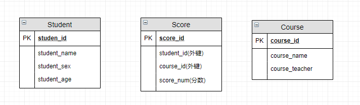

- 数据库类型
  关系型数据库
- 基本概念
	- 元组 ： 元组（tuple）是关系数据库中的基本概念，关系是一张表，表中的每行（即数据库中的每条记录）就是一个元组，每列就是一个属性。 在二维表里，元组也称为行。
	- 码 ：码就是能唯一标识实体的属性，对应表中的列。
	- 候选码 ： 若关系中的某一属性或属性组的值能唯一的标识一个元组，而其任何、子集都不能再标识，则称该属性组为候选码。例如：在学生实体中，“学号”是能唯一的区分学生实体的，同时又假设“姓名”、“班级”的属性组合足以区分学生实体，那么{学号}和{姓名，班级}都是候选码。
	- 主码 : 主码也叫主键。主码是从候选码中选出来的。 一个实体集中只能有一个主码，但可以有多个候选码。
	- 外码 : 外码也叫外键。如果一个关系中的一个属性是另外一个关系中的主码则这个属性为外码。
	- 主属性 ： 候选码中出现过的属性称为主属性。比如关系 工人（工号，身份证号，姓名，性别，部门）. 显然工号和身份证号都能够唯一标示这个关系，所以都是候选码。工号、身份证号这两个属性就是主属性。如果主码是一个属性组，那么属性组中的属性都是主属性。
	- 非主属性： 不包含在任何一个候选码中的属性称为非主属性。比如在关系——学生（学号，姓名，年龄，性别，班级）中，主码是“学号”，那么其他的“姓名”、“年龄”、“性别”、“班级”就都可以称为非主属性。
- 函数依赖
	- 函数依赖（functional dependency） ：若在一张表中，在属性（或属性组）X 的值确定的情况下，必定能确定属性 Y 的值，那么就可以说 Y 函数依赖于 X，写作 X → Y。
	- 部分函数依赖（partial functional dependency） ：如果 X→Y，并且存在 X 的一个真子集 X0，使得 X0→Y，则称 Y 对 X 部分函数依赖。比如学生基本信息表 R 中（学号，身份证号，姓名）当然学号属性取值是唯一的，在 R 关系中，（学号，身份证号）->（姓名），（学号）->（姓名），（身份证号）->（姓名）；所以姓名部分函数依赖与（学号，身份证号）；
	- 完全函数依赖(Full functional dependency) ：在一个关系中，若某个非主属性数据项依赖于全部关键字称之为完全函数依赖。比如学生基本信息表 R（学号，班级，姓名）假设不同的班级学号有相同的，班级内学号不能相同，在 R 关系中，（学号，班级）->（姓名），但是（学号）->(姓名)不成立，（班级）->(姓名)不成立，所以姓名完全函数依赖于（学号，班级）；
	- 传递函数依赖 ： 在关系模式 R(U)中，设 X，Y，Z 是 U 的不同的属性子集，如果 X 确定 Y、Y 确定 Z，且有 X 不包含 Y，Y 不确定 X，（X∪Y）∩Z=空集合，则称 Z 传递函数依赖(transitive functional dependency) 于 X。传递函数依赖会导致数据冗余和异常。传递函数依赖的 Y 和 Z 子集往往同属于某一个事物，因此可将其合并放到一个表中。比如在关系 R(学号 , 姓名, 系名，系主任)中，学号 → 系名，系名 → 系主任，所以存在非主属性系主任对于学号的传递函数依赖。。
- 数据库范式
  1NF(第一范式)
  定义:属性（对应于表中的字段）不能再被分割，也就是这个字段只能是一个值，不能再分为多个其他的字段了。
  关系数据库:1NF 是所有关系型数据库的最基本要求 ，也就是说关系型数据库中创建的表一定满足第一范式。
  2NF(第二范式)
  定义:2NF：1NF 的基础之上，消除了非主属性对于码的部分函数依赖。
  第二范式在第一范式的基础上增加了一个列，这个列称为主键，非主属性都依赖于主键。
  
  3NF(第三范式)
  定义:3NF：3NF 在 2NF 的基础之上，消除了非主属性对于码的传递函数依赖 。
-
-
-
- E-R 图 也称实体-联系图(Entity Relationship Diagram)
  提供了表示实体类型、属性和联系的方法，用来描述现实世界的概念模型
  
  
- SQL truncate,delete与drop区别
- 数据库设计通常步骤
  1. 需求分析 : 分析用户的需求，包括数据、功能和性能需求。
  2. 概念结构设计 : 主要采用 E-R 模型进行设计，包括画 E-R 图。
  3. 逻辑结构设计 : 通过将 E-R 图转换成表，实现从 E-R 模型到关系模型的转换。
  4. 物理结构设计 : 主要是为所设计的数据库选择合适的存储结构和存取路径。
  5. 数据库实施 : 包括编程、测试和试运行
  6. 数据库的运行和维护 : 系统的运行与数据库的日常维护。