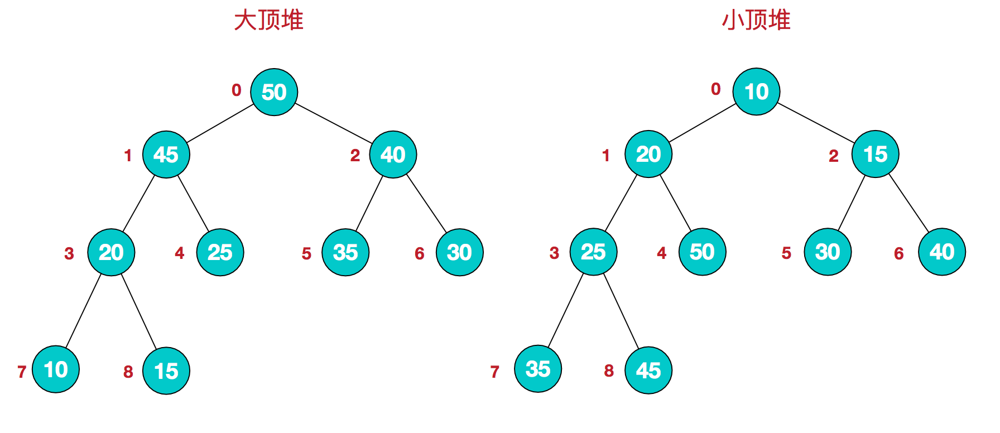

- 数组
- 链表
- 字符串
- 队列
- 栈
- 堆
- 哈希表
  数组+链表/红黑树
  跳跃表
- 跳跃表:保证有序性
- 树
	- [[[二叉树]]]
	- 堆
	  id:: 62ac373c-12fc-4202-9945-3195b665ff28
	  就是完全二叉树 ((629db27e-5618-4467-b25a-616234b6d727))
	  堆是具有以下性质的完全二叉树：
	  每个结点的值都大于或等于其左右孩子结点的值，称为大顶堆；
	  或者每个结点的值都小于或等于其左右孩子结点的值，称为小顶堆。
	  
	- N叉树
	- B树，也叫B-树(Balanced Tree)
	  多路平衡查找树
	- B+树
	  多路平衡查找树
	  B+ 树是 B 树的一种变体
	  应用:MySQL InnoDB索引存储数据结构
	- B 树& B+树两者有何异同呢？
	  id:: 62ac3744-38c3-4b55-8676-4dedff504ccd
	  1. B 树的所有节点既存放键(key) 也存放 数据(data)，而 B+树只有叶子节点存放 key 和 data，其他内节点只存放 key。
	  2. B 树的叶子节点都是独立的;B+树的叶子节点有一条引用链指向与它相邻的叶子节点。
	  3. B 树的检索的过程相当于对范围内的每个节点的关键字做二分查找，可能还没有到达叶子节点，检索就结束了。而 B+树的检索效率就很稳定了，任何查找都是从根节点到叶子节点的过程，叶子节点的顺序检索很明显。
	- 红黑树
	  红黑树是一种二叉平衡搜索树
- 图
- 应用数据结构
  [[布隆过滤器]]