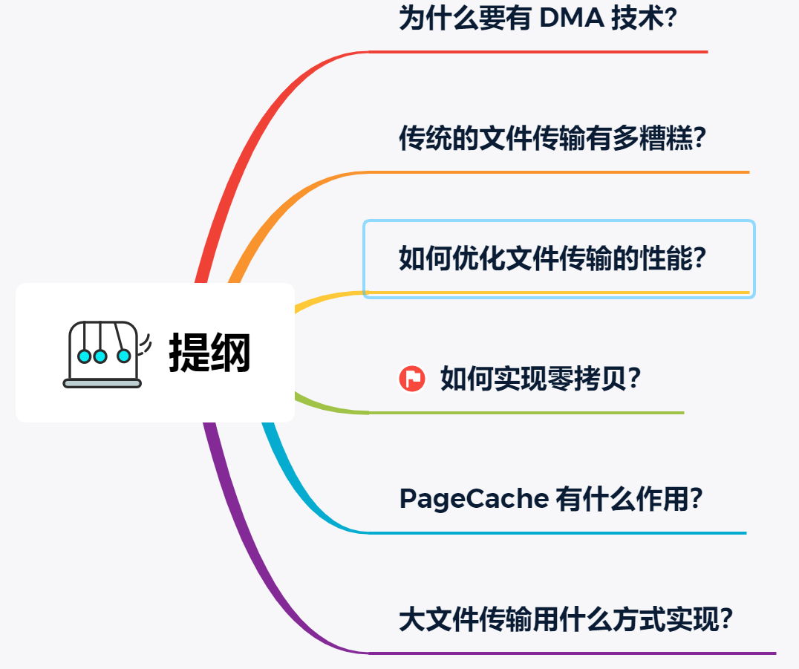

- 引言:磁盘IO访问速度，内存访问速度，CPU访问速度成几何倍速差异,那么该如何提高文件传输效率呢？
  {:height 665, :width 785}
- 传统IO模式的效率底下性
  ((ec116d1e-b1c3-444c-b4f7-6a836c89e900))
- DMA技术
  ((62937793-b6da-4236-b21b-4a95343d54c6))
- 如何优化传统文件传输效率
  1. 减少上下文切换次数--->减少系统调用次数
  2. 文件传输场景中不需要对数据进行修改,用户空间缓存区没有必要存在
- [[文件传输的零拷贝技术]]
-
- PageCache
  id:: 62937615-7832-4a74-ab15-10dcd930e816
  PageCache:上面优化第一步都是先需要先把磁盘文件数据拷贝「内核缓冲区」里，这个「内核缓冲区」实际上是磁盘高速缓存（PageCache）。
  
  零拷贝使用了 PageCache 技术，可以使得零拷贝进一步提升了性能
  
  1. 时间局部性原理--->PageCache 来缓存最近被访问的数据
  当空间不足时淘汰最久未被访问的缓存。
  
  2. 空间局部性原理--->PageCache 使用了「预读功能」
  比如，假设 read 方法每次只会读 32 KB 的字节，虽然 read 刚开始只会读 0 ～ 32 KB 的字节，但内核会把其后面的 32～64 KB 也读取到 PageCache，这样后面读取 32～64 KB 的成本就很低，如果在 32～64 KB 淘汰出 PageCache 前，进程读取到它了，收益就非常大。
  
  好处：
  1. 缓存带来的好处,减少I/O访问次数。
  2. 预读带来的好处,减少I/O访问次数。
  3. 内核的 I/O 调度算法会缓存尽可能多的 I/O 请求在 PageCache 中，最后「合并」成一个更大的 I/O 请求再发给磁盘，这样做是为了减少磁盘的寻址操作(文件异步刷盘？？？)
  
  限制:针对大文件的传输，不应该使用 PageCache，也就是说不应该使用零拷贝技术，
  大文件传输PageCache的问题
  1. PageCache 由于长时间被大文件占据，其他「热点」的小文件可能就无法充分使用到 PageCache，于是这样磁盘读写的性能就会下降了；
  2. PageCache 中的大文件数据，由于没有享受到缓存带来的好处，但却耗费 DMA 多拷贝到 PageCache 一次；
- 大文件传输该使用什么传输呢
  缓存 I/O:使用 PageCache 的 I/O,也是标准IO ((62943773-36d6-4fcd-8bbc-7bc6a64dcd08)) 
  直接 I/O:绕开 PageCache的I/O
  
  
  关于各种IO模型与PageCache的关系。
  零拷贝技术使用到了PageCache.
  异步 I/O 并没有涉及到 PageCache,通常磁盘只支持直接IO
  
  
  
  直接IO的典型使用场景：
  1. 应用程序已经实现了磁盘数据的缓存，那么可以不需要 PageCache 再次缓存，减少额外的性能损耗。在 MySQL 数据库中，可以通过参数设置开启直接 I/O，默认是不开启；
  2. 传输大文件的时候，由于大文件难以命中 PageCache 缓存，而且会占满 PageCache 导致「热点」文件无法充分利用缓存，从而增大了性能开销，因此，这时应该使用直接 I/O。
  
  
  **在高并发的场景下，针对大文件的传输的方式，应该使用「异步 I/O + 直接 I/O」来替代零拷贝技术。**
  异步IO解决最开始的传统IO阻塞问题
  直接IO解决PageCache缓存问题
  
  配置：
  在 Nginx 里，可以通过配置，设定一个文件大小阈值，针对大文件使用异步 IO 和直接 IO，而对小文件使用零拷贝。
  配置作用：当文件大小大于 directio 值后，使用「异步 I/O + 直接 I/O」，否则使用「零拷贝技术」。
  ```nginx config
  location /video/ { 
      sendfile on; 
      aio on; 
      directio 1024m; 
  }
  ```
- 资料
  [文件传输效率提高](https://www.cnblogs.com/xiaolincoding/p/13719610.html)
-