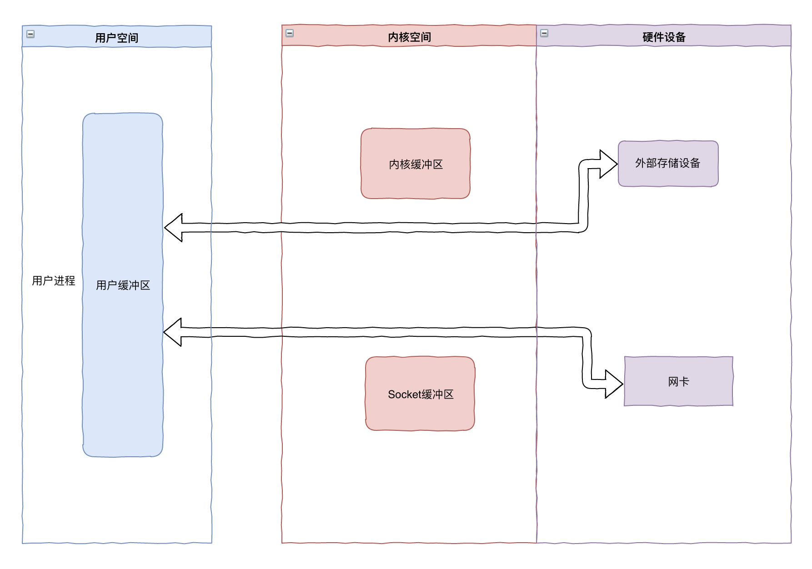
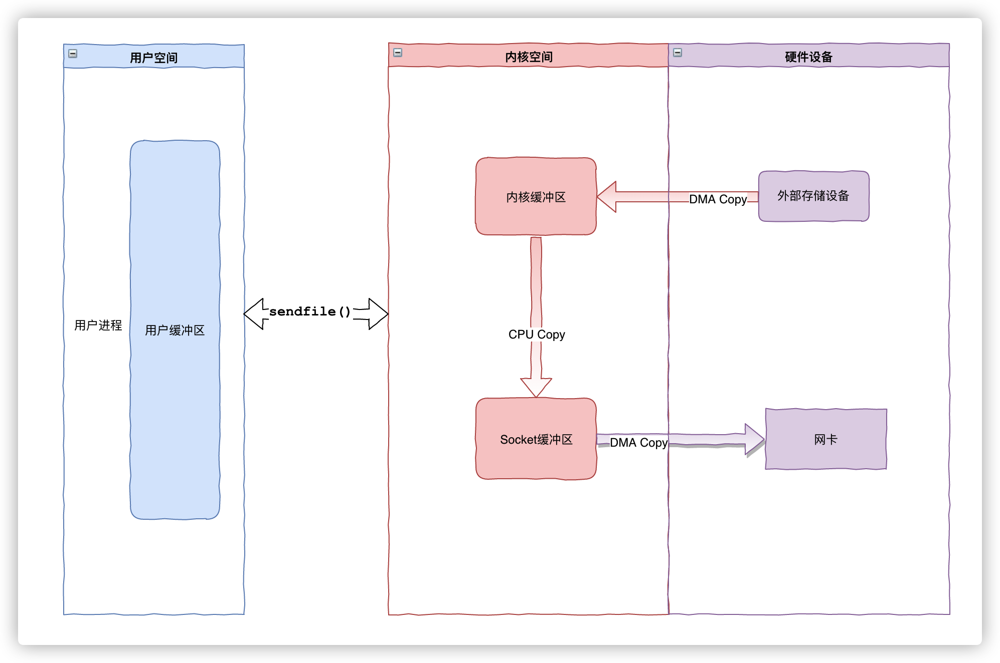
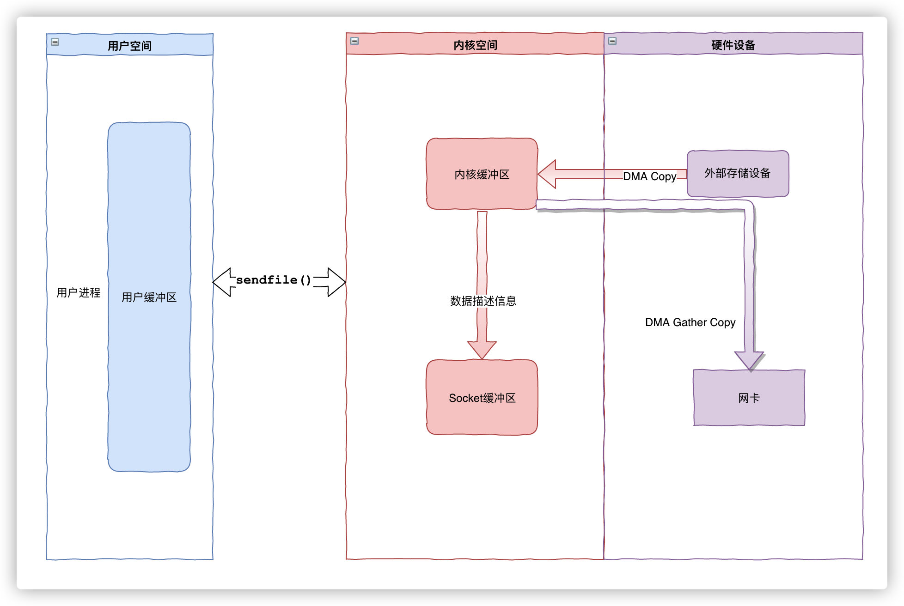
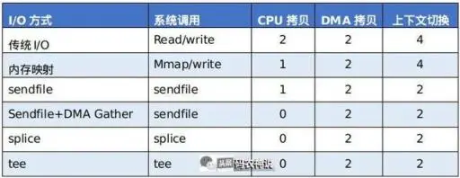

- 文件传输的零拷贝技术
  文件传输涉及到读，写两个IO操作过程  #IO模型
  定义:在文件传输的读写IO过程中(读，写两个过程，之前谈的默认都是一个过程),CPU不需要参与数据拷贝。
  目的是：基于DMA,为了实现零CPU数据拷贝，所有数据都是通过DMA传输的。
	-
	- 各种文件传输IO技术比较
	  开销分析：一次系统调用涉及涉及到两次上下文切换。
		- 1. 传统IO
		  系统调用：两次系统调用read和write函数。
		   
		  开销分析：在进行一次读写时共涉及了4次上下文切换，2次 DMA 拷贝以及2次 CPU 拷贝。
		- 2.用户态直接IO
		  应用程序直接访问硬件存储。硬件上的数据直接拷贝给用户空间，也就不存在内核空间缓冲区和用户空间缓冲区间的数据拷贝了。
		  使应用进程或处于用户态下的库函数跨过内核直接访问硬件，内核在数据传输过程除了进行必要的虚拟存储配置工作外，不参与任何其他工作。
		  
		  使用范围:只适用于不需要内核缓冲区处理的应用程序，这些应用程序通常在进程地址空间有自己的数据缓存机制，又称为自缓存应用程序，如数据库管理系统，mysql的innodb引擎内存缓存机制。
		  局限性:其次，因 CPU 和磁盘 I/O 之间的性能差距，就会造成资源的浪费，一般是会配合异步 I/O 使用。(innodb批量异步刷盘)
		- 3.mmap内存映射+write
		  MMAP 是数据不会到达用户空间内存，只会存在于系统空间的内存上，用户空间与系统空间共用同一个缓冲区，两者通过映射关联。
		  系统调用:文件传输过程中需要两个系统调用mmap和write函数。
		  ```c
		  buf = mmap(file, len);
		  write(sockfd, buf, len);
		  ```
		   
		  开销分析:发生了 4 次上下文切换 + 1 次 CPU 拷贝 + 2 次 DMA 拷贝。内核空间和用户空间之间就不需要数据拷贝了。系统调用还是 2 次，所以还是4次上下文切换。
		- 4. sendfile
		  系统调用:用户进程不需要单独调用 read/write ，而是直接调用 sendfile()
		  函数分析:
		  ```c
		  #include <sys/socket.h>
		  ssize_t sendfile(int out_fd, int in_fd, off_t *offset, size_t count);
		  ```
		  它的前两个参数分别是目的端和源端的文件描述符，后面两个参数是源端的偏移量和复制数据的长度，返回值是实际复制数据的长度。
		  
		  与mmap内存映射方式不同的是，sendfile() 调用中数据对用户空间是完全不可见的。
		   
		  开销分析：整个过程发生 2 次上下文切换，1 次 CPU 拷贝和 2 次 DMA 拷贝。
		- 5. sendfile + DMA gather copy
		  *这是真正的文件传输零拷贝技术*
		  linux2.4版本以上，网卡支持 SG-DMA（The Scatter-Gather Direct Memory Access）技术（和普通的 DMA 有所不同）
		  SG-DMA功能描述:可以将对应的数据描述信息（内存地址、地址偏移量）记录到相应的网络缓冲区（ socket buffer），由DMA 根据这些信息直接将内核缓冲区的数据拷贝到网卡设备中，省下了最后一次 CPU 拷贝。
		  查看linux网卡是否支持SG-DMA
		  ```shell
		  $ ethtool -k eth0 | grep scatter-gather
		  scatter-gather: on
		  ```
		  系统调用:一次系统调用sendfile
		   
		  开销分析：只发生 2 次上下文切换 + 2 次 DMA 数据拷贝。
		  使用范围:只适用于将数据从文件拷贝到网卡上
		- 6. splice
		  各个技术的优缺点:
		  7. tee
		  tee 与 splice 类同，但 fd_in 和 fd_out 都必须是管道。
		- 开销比较汇总
		  
	-
- 零拷贝技术开销分析:
  零拷贝技术的文件传输方式相比传统文件传输的方式，减少了 2 次上下文切换和2次数据拷贝次数，只需要 2 次上下文切换和2次DMA数据拷贝次数(不需要CPU拷贝)，就可以完成文件的传输。
- 使用零拷贝技术的项目
  Kafka，Netty, Nginx(默认开启零拷贝技术)