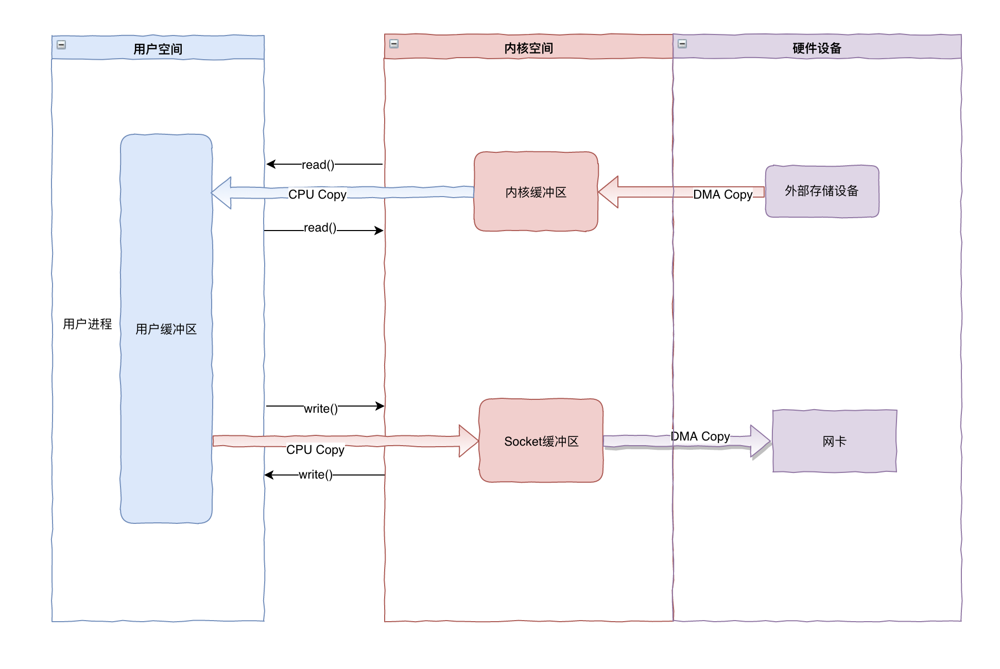

- 文件传输的零拷贝技术
  文件传输涉及到读，写两个IO操作过程
  定义:在文件传输的读写IO过程中(读，写两个过程，之前谈的默认都是一个过程),CPU不需要参与数据拷贝。
  目的是：基于DMA,为了实现零CPU数据拷贝，所有数据都是通过DMA传输的。
  #IO模型
	- 各种文件传输IO技术比较
		- 1. 传统IO
		   
		  开销分析：在进行一次读写时共涉及了4次上下文切换，2次 DMA 拷贝以及2次 CPU 拷贝。
		- 2.用户态直接IO
		  应用程序直接访问硬件存储。硬件上的数据直接拷贝给用户空间，也就不存在内核空间缓冲区和用户空间缓冲区间的数据拷贝了。
		- 3.
		- 4.
		- 5.
		- 6
	-
- 零拷贝技术开销分析:
  零拷贝技术的文件传输方式相比传统文件传输的方式，减少了 2 次上下文切换和2次数据拷贝次数，只需要 2 次上下文切换和2次DMA数据拷贝次数(不需要CPU拷贝)，就可以完成文件的传输。
- 使用零拷贝技术的项目
  Kafka，Netty