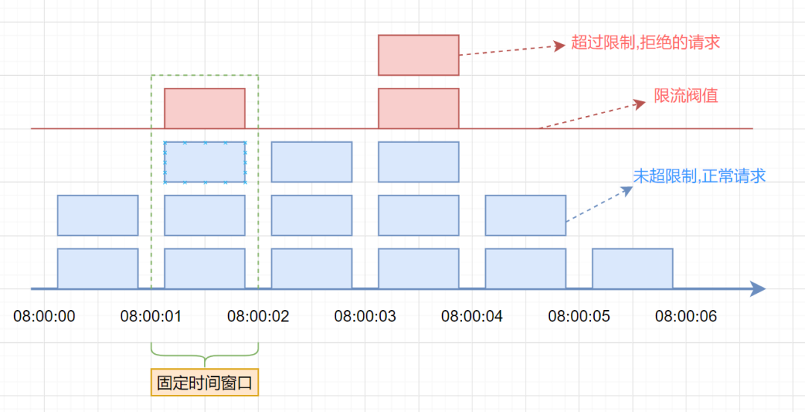
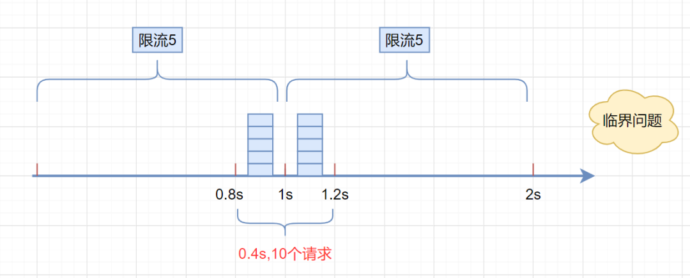
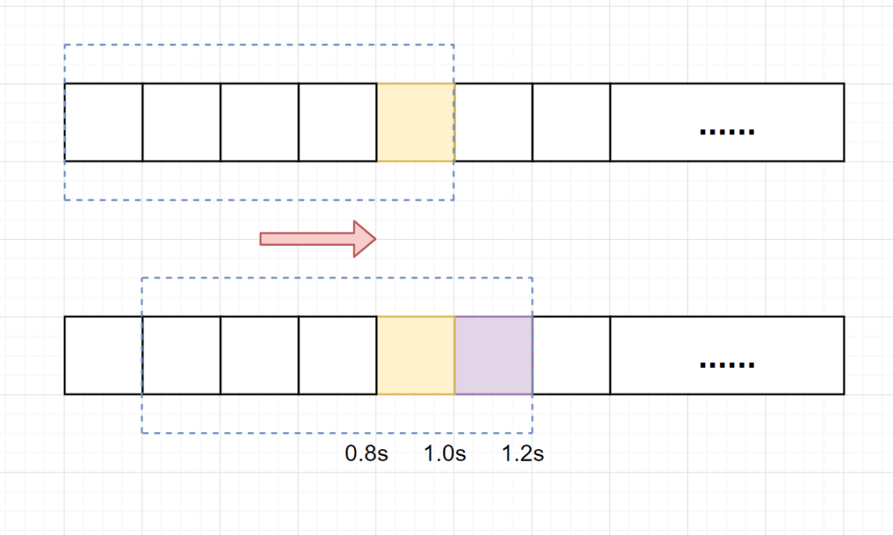
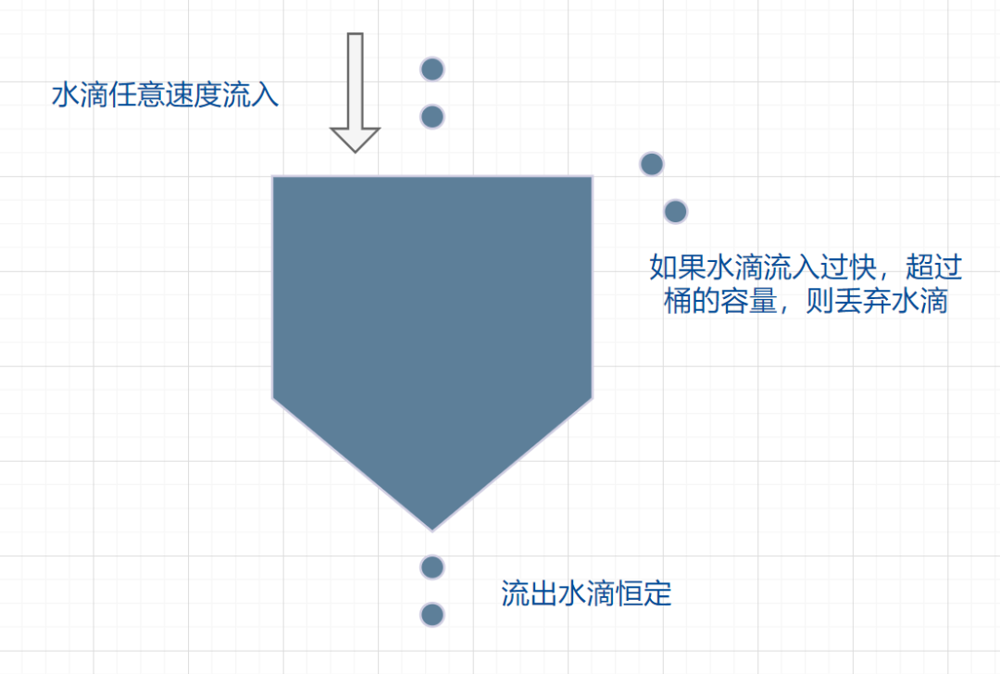
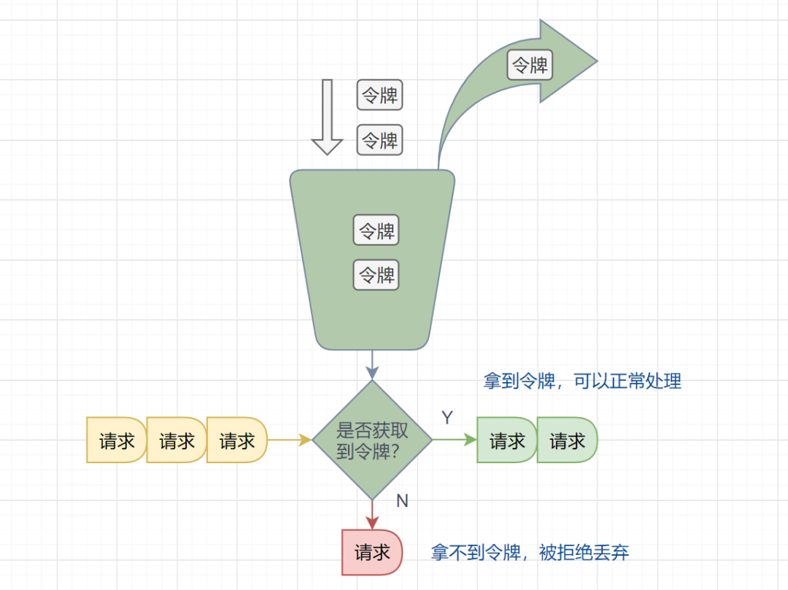
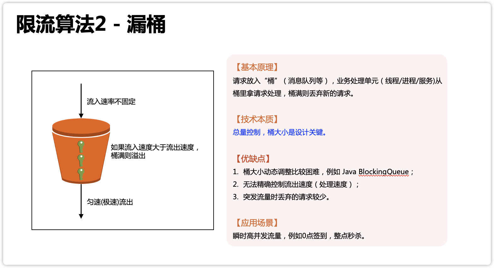
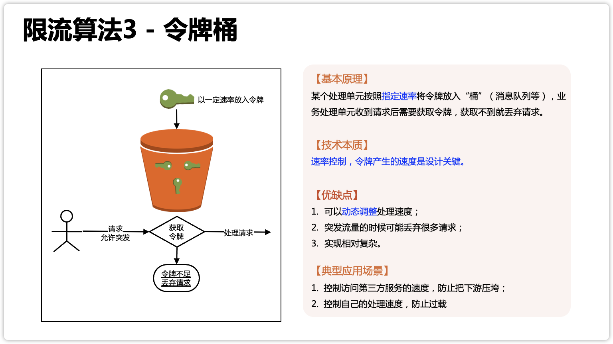
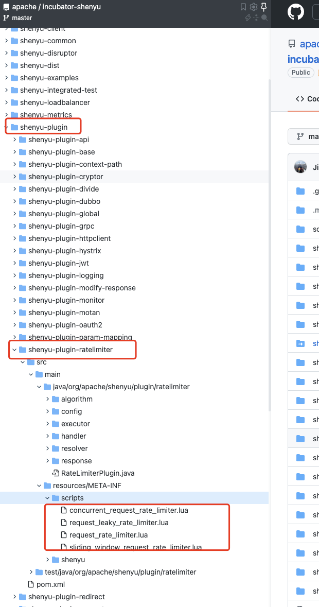

- 限流
  >In computer networks, rate limiting is used to control the rate of requests sent or received by a network interface controller. It can be used to prevent DoS attacks and limit web scraping。---维基百科解释
  
  简单翻译下:在计算机网络中，限流就是控制网络接口发送或接收请求的速率，它可防止DoS攻击和限制Web爬虫。
  
  限流，也称流量控制。是指系统在面临高并发，或者大流量请求的情况下，限制新的请求对系统的访问，从而保证系统的稳定性。
  
  --->类比热门旅游景区限流:一些热门的旅游景区，一般会对每日的旅游参观人数有限制的。每天只会卖出固定数目的门票，比如5000张。假设在五一、国庆假期，你去晚了，可能当天的票就已经卖完了，就无法进去游玩了。即使你进去了，排队也能排到你怀疑人生。
- 限流算法
  4大经典限流算法
	- 固定窗口限流算法
	  首先维护一个计数器，将单位时间段当做一个窗口，计数器记录这个窗口接收请求的次数。
	  1. 当次数少于限流阀值，就允许访问，并且计数器+1
	  2. 当次数大于限流阀值，就拒绝访问。
	  3. 当前的时间窗口过去之后，计数器清零。
	  
	  
	  描述:假设单位时间是1秒，限流阀值为3。在单位时间1秒内，每来一个请求,计数器就加1，如果计数器累加的次数超过限流阀值3，后续的请求全部拒绝。等到1s结束后，计数器清0，重新开始计数。如下图：
	  伪代码如下
	  ```
	  /**
	   * 固定窗口限流算法
	   *
	   * @author chujun
	   * @date 2022/6/23
	   */
	  public class FixedWindowRateLimitAlgorithm {
	      /*默认配置:1s内访问限流阈值10个*/
	      private int thresholdConfig = 10;
	      private int windowUnitSecondConfig = 1;
	  
	      private AtomicInteger counter = new AtomicInteger(0);
	  
	      private AtomicLong lastRequestTime = new AtomicLong(0);
	  
	      public FixedWindowRateLimitAlgorithm() {
	      }
	  
	      public FixedWindowRateLimitAlgorithm(final int thresholdConfig, final int windowUnitSecondConfig) {
	          this.thresholdConfig = thresholdConfig;
	          this.windowUnitSecondConfig = windowUnitSecondConfig;
	      }
	  
	      /**
	       * 固定窗口时间算法
	       *
	       * @return
	       */
	      boolean fixedWindowsTryAcquire() {
	          //获取系统当前时间
	          long currentTime = System.currentTimeMillis();
	          //检查是否在时间窗口内
	          if (currentTime - lastRequestTime.get() > (windowUnitSecondConfig * 1000)) {
	              // 计数器清0
	              counter.compareAndSet(counter.get(), 0);
	              //开启新的时间窗口
	              lastRequestTime.compareAndSet(lastRequestTime.get(), currentTime);
	              System.out.println(counter.get() + "," + lastRequestTime.get());
	          }
	          // 小于阀值
	          System.out.println(counter.get() + "," + thresholdConfig);
	          if (counter.get() < thresholdConfig) {
	              //计数器加1
	              counter.getAndIncrement();
	              return true;
	          }
	  
	          return false;
	      }
	  }
	  ```
	  算法缺点
	  这种算法有一个很明显的临界问题：假设限流阀值为5个请求，单位时间窗口是1s,如果我们在单位时间内的前0.8-1s和1-1.2s，分别并发5个请求。虽然都没有超过阀值，但是如果算0.8-1.2s,则并发数高达10，已经超过单位时间1s不超过5阀值的定义啦。
	  
	- 滑动窗口限流算法
	  滑动窗口限流解决固定窗口临界值的问题。它将单位时间周期分为n个小周期，分别记录每个小周期内接口的访问次数，并且根据时间滑动删除过期的小
	  周期。
	  图解:
	  
	  假设单位时间还是1s，总限流阀值还是为5个请求，滑动窗口算法把它划分为5个小周期，也就是滑动窗口（单位时间）被划分为5个小格子。每格表示0.2s。每过0.2s，时间窗口就会往右滑动一格。然后呢，每个小周期，都有自己独立的计数器，如果请求是0.83s到达的，0.8~1.0s对应的计数器就会加1。
	  我们来看下滑动窗口是如何解决临界问题的？
	  假设我们1s内的限流阀值还是5个请求，0.8~1.0s内（比如0.9s的时候）来了5个请求，落在黄色格子里。时间过了1.0s这个点之后，又来5个请求，落在紫色格子里。如果是固定窗口算法，是不会被限流的，但是滑动窗口的话，每过一个小周期，它会右移一个小格。过了1.0s这个点后，会右移一小格，当前的单位时间段窗口是0.2~1.2s，这个区域的请求已经超过限定的5了，已触发限流啦，实际上，紫色格子的请求都被拒绝啦。
	  TIPS: 当滑动窗口的格子周期划分的越多，那么滑动窗口的滚动就越平滑，限流的统计就会越精确。
	  问题:滑动窗口算法虽然解决了固定窗口的临界问题，但是一旦到达限流后，请求都会直接暴力被拒绝。 
	  --->漏桶算法和令牌桶算法相比较而言可以蓄一部分请求流量。
	  伪代码如下:
	  ```
	  	/**
	   * 滑动窗口限流算法
	   *
	   * @author chujun
	   * @date 2022/6/23
	   */
	  public class SlidingWindowRateLimitV2Algorithm {
	      /**
	       * 单位划分的小周期（默认单位时间是1分钟，10s一个小格子窗口，一共6个格子）
	       */
	      private int subCyclePerWindowConfig = 10;
	  
	      /**
	       * 窗口大小,单位:秒
	       */
	      private int windowSecondConfig = 60;
	  
	      /**
	       * 请求限流阈值
	       */
	      private int thresholdConfig = 100;
	  
	      /**
	       * 计数器, k-为当前窗口的开始时间值秒，value为当前窗口的计数
	       */
	      private TreeMap<Long, Integer> counters = new TreeMap<>();
	  
	      public SlidingWindowRateLimitV2Algorithm() {
	      }
	  
	      public SlidingWindowRateLimitV2Algorithm(final int subCyclePerWindowConfig,
	                                               final int windowSecondConfig,
	                                               final int thresholdConfig) {
	          this.subCyclePerWindowConfig = subCyclePerWindowConfig;
	          this.windowSecondConfig = windowSecondConfig;
	          this.thresholdConfig = thresholdConfig;
	      }
	  
	      /**
	       * 滑动窗口时间算法实现
	       */
	      boolean slidingWindowsTryAcquire() {
	          //获取当前时间在哪个小周期窗口:小周期窗口开始时间点
	          long currentSubCycleWindowStartTime = LocalDateTime.now().toEpochSecond(ZoneOffset.UTC) / subCyclePerWindowConfig * subCyclePerWindowConfig;
	          //当前窗口总请求数
	          int currentWindowNum = countCurrentWindow(currentSubCycleWindowStartTime);
	  
	          //超过阀值限流
	          if (currentWindowNum >= thresholdConfig) {
	              return false;
	          }
	  
	          //计数器+1
	          counters.merge(currentSubCycleWindowStartTime, 1, Integer::sum);
	          return true;
	      }
	  
	      /**
	       * 统计当前窗口的请求数
	       */
	      private int countCurrentWindow(long currentSubCycleWindowStartTime) {
	          //计算窗口开始位置
	          long startTime = currentSubCycleWindowStartTime - subCyclePerWindowConfig * (windowSecondConfig / subCyclePerWindowConfig - 1);
	          int count = 0;
	  
	          //遍历存储的计数器
	          Iterator<Map.Entry<Long, Integer>> iterator = counters.entrySet().iterator();
	          while (iterator.hasNext()) {
	              Map.Entry<Long, Integer> entry = iterator.next();
	              // 删除无效过期的子窗口计数器，不删除的话数据会一直堆积
	              if (entry.getKey() < startTime) {
	                  iterator.remove();
	              } else {
	                  //累加当前窗口的所有计数器之和
	                  count += entry.getValue();
	              }
	          }
	          return count;
	      }
	  
	      public int getTotalStoredSize() {
	          return counters.size();
	      }
	  }
	  ```
	- 漏桶算法
	  优点:漏桶算法面对限流，就更加的柔性，不存在直接的粗暴拒绝。
	  它的原理很简单，可以认为就是注水漏水的过程。往漏桶中以任意速率流入水，以固定的速率流出水。
	  当水超过桶的容量时，会被溢出，也就是被丢弃。因为桶容量是不变的，保证了整体的速率。
	  
	  说明：
	  1. 流入的水滴，可以看作是访问系统的请求，这个流入速率是不确定的。
	  2. 桶的容量一般表示系统所能处理的最大请求数。
	  3. 如果桶的容量满了，就达到限流的阀值，就会丢弃水滴（拒绝请求）
	  4. 流出的水滴，是恒定过滤的，对应服务按照固定的处理速率处理请求。(但这是期望上的，实际上处理速度这儿没法控制,由下端处理速度控制,处理速度可能发生变化)
	  实现：类似于有界消息队列
	  ```
	  /**
	   * @author chujun
	   * @date 2022/6/24
	   */
	  public class LeakyBucketRateLimitAlgorithm {
	      /**
	       * 每秒处理数（出水率）
	       */
	      private long rateConfig = 10;
	  
	      /**
	       * 桶容量
	       */
	      private long capacityConfig = 100;
	  
	      /**
	       * 当前剩余水量
	       */
	      private long remainingWater = 0;
	  
	      /**
	       * 最后刷新时间
	       */
	      private long refreshTime = 0;
	  
	      private ReentrantLock lock = new ReentrantLock();
	  
	      public LeakyBucketRateLimitAlgorithm() {
	      }
	  
	      public LeakyBucketRateLimitAlgorithm(final long rateConfig, final long capacityConfig) {
	          this.rateConfig = rateConfig;
	          this.capacityConfig = capacityConfig;
	      }
	  
	      /**
	       * 漏桶算法
	       *
	       * @return
	       */
	      boolean leakyBucketLimitTryAcquire() {
	          lock.lock();
	          try {
	              //获取系统当前时间
	              long currentTime = System.currentTimeMillis();
	              //流出的水量 =(当前时间-上次刷新时间)* 出水率
	              System.out.println("currentTime-refreshTime:" + (currentTime - refreshTime));
	  			//注意这儿还是存在少量无法组成一个水滴,小数被舍弃掉了，不是特别精准
	              long outWater = (long) ((currentTime - refreshTime) / 1000.0 * rateConfig);
	              // 当前水量 = 之前的桶内水量-流出的水量
	  
	              remainingWater = Math.max(0, remainingWater - outWater);
	  
	              // 刷新时间
	              if (outWater > 0) {
	                  refreshTime = currentTime;
	              }
	  
	              // 当前剩余水量还是小于桶的容量，则请求放行
	              if (remainingWater < capacityConfig) {
	                  System.out.println("++:remainingWater:" + remainingWater + ",currentTime:" + currentTime + ",outWater:" + outWater);
	                  remainingWater++;
	                  return true;
	              }
	  
	              // 当前剩余水量大于等于桶的容量，限流
	              System.out.println("remainingWater:" + remainingWater + ",currentTime:" + currentTime + ",outWater:" + outWater);
	              return false;
	          } finally {
	              lock.unlock();
	          }
	      }
	  }
	  ```
	- 令牌桶算法
	  令牌桶算法原理：
	  1. 有一个令牌管理员，根据限流大小，定速往令牌桶里放令牌。
	  2. 如果令牌数量满了，超过令牌桶容量的限制，那就丢弃。
	  3. 系统在接受到一个用户请求时，都会先去令牌桶要一个令牌。如果拿到令牌，那么就处理这个请求的业务逻辑；
	  4. 如果拿不到令牌，就直接拒绝这个请求。
	  
	  漏桶算法代码实现如下：
	  ```
	  /**
	   * 令牌桶算法
	   *
	   * @author chujun
	   * @date 2022/6/24
	   */
	  public class TokenBucketRateLimitAlgorithm {
	      /**
	       * 每秒处理数（放入令牌数量）
	       */
	      private long putTokenPerSecondRateConfig = 10;
	  
	      /**
	       * 令牌桶容量
	       */
	      private long capacityConfig = 100;
	  
	      /**
	       * 最后刷新时间
	       */
	      private long refreshTime;
	  
	      /**
	       * 当前桶内令牌数
	       */
	      private long currentToken = 0L;
	  
	      private ReentrantLock lock = new ReentrantLock();
	  
	      public TokenBucketRateLimitAlgorithm() {
	      }
	  
	      public TokenBucketRateLimitAlgorithm(final long putTokenPerSecondRateConfig, final long capacityConfig) {
	          this.putTokenPerSecondRateConfig = putTokenPerSecondRateConfig;
	          this.capacityConfig = capacityConfig;
	      }
	  
	      /**
	       * 漏桶算法
	       */
	      public boolean tokenBucketTryAcquire() {
	          lock.lock();
	          try {
	              //获取系统当前时间
	              long currentTime = System.currentTimeMillis();
	              //生成的令牌 =(当前时间-上次刷新时间)* 放入令牌的速率，生成token数也不是特别进准,小数部分被舍弃了
	              long generateToken = (long) ((currentTime - refreshTime) / 1000.0 * putTokenPerSecondRateConfig);
	              // 当前令牌数量 = 之前的桶内令牌数量+放入的令牌数量
	              currentToken = Math.min(capacityConfig, generateToken + currentToken);
	              // 刷新时间
	              if (generateToken > 0) {
	                  refreshTime = currentTime;
	              }
	  
	              //桶里面还有令牌，请求正常处理
	              if (currentToken > 0) {
	                  //令牌数量-1
	                  currentToken--;
	                  return true;
	              }
	  
	              return false;
	          } finally {
	              lock.unlock();
	          }
	      }
	  }
	  ```
	- 漏桶算法和令牌桶算法的区别
	  漏桶的本质是总量控制，令牌桶的本质是速率控制
	  
	  
	  关于“保护别人”的理解
	  这个主要应用于访问第三方，最典型的例子就是双十一的支付宝，支付的时候要访问银行的接口，银行的接口实际上处理高并发的能力并不强（例如澳门某银行对外提供的移动支付接口，峰值 TPS 是 30 次/s），这个时候支付宝自己处理性能再高都没用，而且越高越容易把下游的银行给压垮，所以支付宝不得不针对下游接口请求做限流。
	  常见误解:
	  1. 常见误解1：漏桶和令牌桶的区别是保护自己还是保护别人吗？
	  很显然不是，令牌桶保护自己和保护下游都可以，而不是说保护自己用令牌桶，保护别人用漏桶。
	  令牌桶就是一个速率控制，你可以用来控制自己的处理速度，也可以控制请求别人的处理速度，都可以起到保护作用；
	  其实漏桶也可以既保护自己又保护下游，因为请求太多的时候把请求先缓存到漏桶里面了，漏桶放不下就丢弃新的请求，这也是保护机制。
	  2 常见误解2：网上的文章都说令牌桶更适合“突发流量”，为何你这里说漏桶更适合“瞬时高并发”？
	  令牌桶的“突发流量”跟我们通常理解的“业务高并发”并不一样。**令牌桶的算法原本是用于网络设备控制传输速度的，而且它控制的目的是保证一段时间内的平均速率控制，**之所以说令牌桶适合突发流量，是指在网络传输的时候，可以允许某段时间内（一般就几秒）超过平均传输速率，这在网络环境下常见的情况就是“网络抖动”，但这个短时间的突发流量是不会导致雪崩效应，网络设备也能够处理得过来。
	  对应到令牌桶应用到业务处理的场景，就要求即使有突发流量来了，系统自己或者下游系统要真的能够处理的过来，否则令牌桶允许突发流量进来，结果系统或者下游处理不了，那还是会被压垮。
	  
	  **漏桶算法更适合“突发流量”，是指秒杀、抢购、整点打卡签到、微博热点事件这种业务高并发场景，它不是由于“XX 抖动”引起的，而是由业务场景引起的**，并且持续的事件可能是几分钟甚至几十分钟，这种业务场景为了用户体验和业务尽量少受损，优先采取的不是丢弃大量请求，而是缓存请求，避免系统出现雪崩效应。
	  
	  所以如果在秒杀、抢购、整点打卡签到、微博热点事件这些业务场景用令牌桶的话，会出现大量用户访问出错，因为请求被直接丢弃了；而用漏桶的话，处理可能只是会慢一些，用户体验会更好一些，所以我认为漏桶更适合“突发流量”。
	  
	  两种算法都具有保护作用
	  漏桶的保护是尽量缓存请求（缓存不下才丢），避免系统出现雪崩效应。
	  令牌桶的保护主要是丢弃请求**（**即使系统还能处理，只要超过指定的速率就丢弃，除非此时动态提高速率**）。
	  
	  适合业务场景:
	  漏桶：秒杀、抢购、整点打卡签到、微博热点事件这些高并发业务场景
	  令牌桶:控制自己的处理速度，防止过载;控制访问第三方服务的速度,保护别人,防止把第三方打垮。
- 单机限流
  google guava 的RateLimiter限流器就是基于令牌桶算法实现的。
  [github official  website:google guava](https://github.com/google/guava)
  除了最基本的令牌桶算法(平滑突发限流)实现之外，Guava 的RateLimiter还提供了 平滑预热限流 的算法实现。
  平滑突发限流就是按照指定的速率放令牌到桶里，而平滑预热限流会有一段预热时间，预热时间之内，速率会逐渐提升到配置的速率。
  ```
  //静态工厂
  public static RateLimiter create(double permitsPerSecond, long warmupPeriod, TimeUnit unit) {
      checkArgument(warmupPeriod >= 0, "warmupPeriod must not be negative: %s", warmupPeriod);
      return create(SleepingStopwatch.createFromSystemTimer(), permitsPerSecond, warmupPeriod, unit,
                    3.0);
    }
  ```
  平滑预热限流示例
  ```
  @Test
      public void testWarmup() {
          // 1s 放 5 个令牌到桶里也就是 0.2s 放 1个令牌到桶里
          // 预热时间为3s,也就说刚开始的 3s 内发牌速率会逐渐提升到 0.2s 放 1 个令牌到桶里
          RateLimiter rateLimiter = RateLimiter.create(5, 3, TimeUnit.SECONDS);
          for (int i = 0; i < 20; i++) {
              double sleepingTime = rateLimiter.acquire(1);
              System.out.printf("get 1 tokens: %sds%n", sleepingTime);
          }
      }
  ```
  执行结果如下
  ```
  get 1 tokens: 0.0ds
  get 1 tokens: 0.569191ds
  get 1 tokens: 0.512808ds
  get 1 tokens: 0.462677ds
  get 1 tokens: 0.410454ds
  get 1 tokens: 0.356603ds
  get 1 tokens: 0.303316ds
  get 1 tokens: 0.248572ds
  get 1 tokens: 0.201207ds
  get 1 tokens: 0.198115ds
  get 1 tokens: 0.195681ds
  get 1 tokens: 0.19672ds
  get 1 tokens: 0.194267ds
  get 1 tokens: 0.199773ds
  get 1 tokens: 0.199412ds
  get 1 tokens: 0.199233ds
  get 1 tokens: 0.198299ds
  get 1 tokens: 0.195696ds
  get 1 tokens: 0.196229ds
  get 1 tokens: 0.196299ds
  ```
  另外，Bucket4j 是一个非常不错的基于令牌/漏桶算法的限流库。
  Spring Cloud Gateway 中自带的单机限流的早期版本就是基于 Bucket4j 实现的。后来，替换成了 Resilience4j。
  Resilience4j 是一个轻量级的容错组件，其灵感来自于 Hystrix。自Netflix 宣布不再积极开发 Hystrix 之后，Spring 官方和 Netflix 都更推荐使用 Resilience4j 来做限流熔断。
- 分布式限流
  借助中间件架限流 ：可以借助 Sentinel 或者使用 Redis 来自己实现对应的限流逻辑。
  网关层限流 ：比较常用的一种方案，直接在网关层把限流给安排上了。不过，通常网关层限流通常也需要借助到中间件/框架。就比如 Spring Cloud Gateway 的分布式限流实现RedisRateLimiter就是基于 Redis+Lua 来实现的，再比如 Spring Cloud Gateway 还可以整合 Sentinel 来做限流。
  
  如果你要基于 Redis 来手动实现限流逻辑的话，建议配合 Lua 脚本来做。
  网上也有很多现成的脚本供你参考，就比如 Apache 网关项目 ShenYu 的 RateLimiter 限流插件就基于 Redis + Lua 实现了令牌桶算法/并发令牌桶算法、漏桶算法、滑动窗口算法。
  [github apache shenyu](https://github.com/apache/incubator-shenyu)
  
- 资料
  [面试必备：4种经典限流算法讲解](https://z.itpub.net/article/detail/B049B6F216829EDD0827E97BC1AA9100)
  [漏桶算法和令牌桶算法，区别到底在哪里？](https://xie.infoq.cn/article/4a0acdd12a0f6dd4a53e0472c)