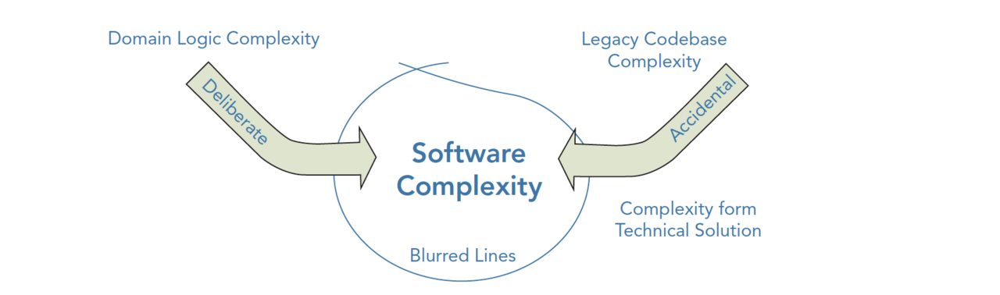

- 包含如何学习架构?
  
- 架构基础到方法论
  包括架构的概述，特点，目标，本质以及方法论等
  软件架构简介
  所谓架构，见仁见智，很难有一个明确或标准的定义；但架构并非镜花水月或阳春白雪，有系统的地方就需要架构，大到航空飞机，小到一个电商系统里面的一个功能组件，都需要设计和架构。抽象而言，架构就是对系统中的实体以及实体之间的关系所进行的抽象描述，是对物/信息的功能与形式元素之间的对应情况所做的分配，是对元素之间的关系以及元素同周边环境之间的关系所做的定义。架构能将目标系统按某个原则进行切分，切分的原则，是要便于不同的角色进行并行工作，结构良好的创造活动要优于毫无结构的创造活动。
  
  **软件架构的核心价值，即是控制系统的复杂性，将核心业务逻辑和技术细节的分离与解耦。**
  软件架构是系统的草图，它描述的对象是直接构成系统的抽象组件；各个组件之间的连接则明确和相对细致地描述组件之间的通信。
  在实现阶段，这些抽象组件被细化为实际的组件，比如具体某个类或者对象。在面向对象领域中，组件之间的连接通常用接口来实现。
  架构师的职责是努力训练自己的思维，用它去理解复杂的系统，通过合理的分解和抽象，理解并解析需求，创建有用的模型，确认、细化并扩展模型，管理架构；能够进行系统分解形成整体架构，能够正确的技术选型，能够制定技术规格说明并有效推动实施落地。
- ## 系统复杂性的来源与应对
  
  Eric Evans 在 Domain‐Driven Design 一书中吐槽了所谓的意大利面式架构，即代码确实做了有用的事，但很难解释它是如何去执行的；他认为造成这种窘境的主要原因是，将领域问题的复杂度与技术细节的复杂度混合在了一起，最终导致整体复杂度的指数级增长。
  
- 如何理解架构
  理解架构，包括架构的视角，架构的演进，服务化演进，架构的核心要素
	- [[架构视角]]
	  在学习架构时，我认为首先要理清楚架构的视角，**因为你所认知的架构和别人所说的架构可能是两码事**。
	  对于不同职位的视角是不一样的，比如
	  对开发而言他更多的看到的是开发架构；
	  对售前人员，他可能更多的看到的是业务架构；
	  对于运维人员，他看到的可能是运维架构；
	  而对于技术支持和部署人员，他更多的看到的网络和物理架构。
	- [[架构的核心要素]]
	  一般来说软件架构需要关注**性能、可用性、伸缩性、扩展性和安全性这5个架构要素**。
	- [[架构演化]]
	  在学习架构时，**第一步不要去学习框架，而是要学习架构的演进**。强烈推荐李智慧老师的《大型网站技术架构》，这本书翻起来很快，对构筑你自己的体系很有帮助，本文的内容来源于它，在此基础上拓展了下。
	- [[架构的服务演化]]
	  Kubernetes、Service Mesh 和 Serverless应该是最近比较火的了，而上文主要从**逻辑架构角度**分析了架构演进，本文将从**服务演化**和**容器编排化**的角度帮你增强对架构演进的认识。
	- [[架构的模式1]] 
	  架构演进中有很多知识点，总体上可以归结为以下模式，**这里说的模式本质是架构中技术点的抽象**。强烈推荐李智慧老师的《大型网站技术架构》，本文的内容也是来源于它，在此基础上拓展了下。
	- [[架构的模式2]]
	  本文整理自[朱晔的互联网架构实践心得 (opens new window)](https://www.cnblogs.com/lovecindywang/p/9670356.html), 他是结合了 **微软给出的云架构的一些模式**的基础上加入他自己的理解来总结互联网架构中具体的一些模式。我在此基础上进行了些微小的调整。
	-
- 架构高并发和高可用
  [[架构之高并发:缓存]]
  **高并发实现的三板斧：缓存，限流和降级**。缓存在高并发系统中有者极其广阔的应用，需要重点掌握，本文重点介绍下缓存及其实现。
  [[架构之高并发:限流]]
  每个系统都有服务的上线，所以当流量超过服务极限能力时，系统可能会出现卡死、崩溃的情况，所以就有了降级和限流。
  限流其实就是：当高并发或者瞬时高并发时，为了保证系统的稳定性、可用性，系统以牺牲部分请求为代价或者延迟处理请求为代价，保证系统整体服务可用。
  [[架构之高并发:降级和熔断]]
  在高并发环境下，**服务之间的依赖关系导致调用失败，解决的方式通常是: 限流->熔断->隔离->降级, 其目的是防止雪崩效应**。
  [[架构之高可用:负载均衡]]
  负载均衡（Load Balance），意思是将负载（工作任务，访问请求）进行平衡、分摊到多个操作单元（服务器，组件）上进行执行。
  是解决高性能，单点故障（高可用），扩展性（水平伸缩）的终极解决方案。
  [[架构之高可用:容灾备份,故障转移]]
  容灾技术是系统的高可用性技术的一个组成部分，容灾系统更加强调处理外界环境对系统的影响，特别是灾难性事件对整个IT节点的影响，提供节点级别的系统恢复功能。故障转移（failover），即当活动的服务或应用意外终止时，快速启用**冗余**或备用的服务器、系统、硬件或者网络接替它们工作。故障恢复是在计划内或计划外中断解决后**切换回主站点**的过程。
- [[架构安全]]
- 分层下看架构技术点
  
  以上采用七层逻辑架构，第一层客户层，第二层前端优化层，第三层应用层，第四层服务层，第五层数据存储层，第六层大数据存储层，第七层大数据处理层。
  **客户层**：减少Http请求数，浏览器缓存，启用压缩，Js异步，减少Cookie传输；
  **前端层**：DNS负载均衡，CDN本地加速，反向代理服务；
  **应用层**：业务拆分；负载均衡，分级管理，应用缓存，服务集群，快速失败，异步调用，服务降级，消息队列，幂等设计等。
  **服务层**：提供公用服务，比如用户服务，订单服务，支付服务等；
  **数据层**：分布式, 数据库集群，读写分离，NOSQL集群，文件系统集群；分布式缓存；冗余备份（冷，热备[同步，异步]，温备），失效转移（确认，转移，恢复）。CAP理论，一致性算法。
  **大数据存储层**：支持应用层和服务层的日志数据收集，关系数据库和NOSQL数据库的结构化和半结构化数据收集；
  **大数据处理层**：通过Mapreduce进行离线数据分析或Storm实时数据分析，并将处理后的数据存入关系型数据库。（实际使用中，离线数据和实时数据会按照业务要求进行分类处理，并存入不同的数据库中，供应用层或服务层使用）。
架构案例分析
	- [京东: 亿级商品详情页设计](https://pdai.tech/md/arch/arch-example-seckill.html))
	- [闲鱼: 亿级商品结构化背后的思考和演进](https://pdai.tech/md/arch/arch-example-xianyu-goods.html)
	- [闲鱼: 多状态多操作的交易链路架构演进](https://pdai.tech/md/arch/arch-example-xianyu-jiaoyi.html)
	- [闲鱼: 拉新投放系统如何设计](https://pdai.tech/md/arch/arch-example-xianyu-laxintoufang.html)
	- [闲鱼: 复杂搜索系统的可靠性优化之路](https://pdai.tech/md/arch/arch-example-xianyu-search.html)
	- [美团: 配送系统架构演进实践](https://pdai.tech/md/arch/arch-example-meituan-peisong.html)
	- [美团: 即时物流的分布式系统架构设计](https://pdai.tech/md/arch/arch-example-meituan-jishiwuliu.html)
	- [美团: 外卖客户端高可用建设体系](https://pdai.tech/md/arch/arch-example-meituan-waimai.html)
	- [美团: 数据库高可用架构的演进与设想](https://pdai.tech/md/arch/arch-example-meituan-db-hp.html)
	- [美团: 数据同步到仓库的架构实践](https://pdai.tech/md/arch/arch-example-meituan-db-binlog.html)
- 资料
  [java全栈知识体系-架构基础](https://pdai.tech/md/arch/arch-x-overview.html)