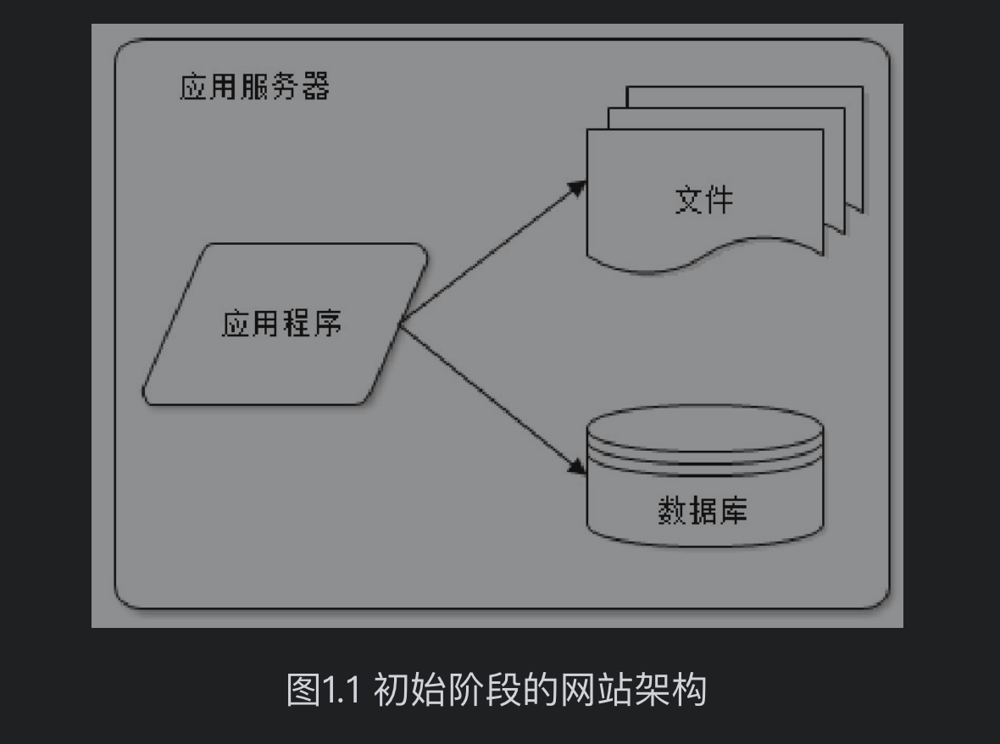
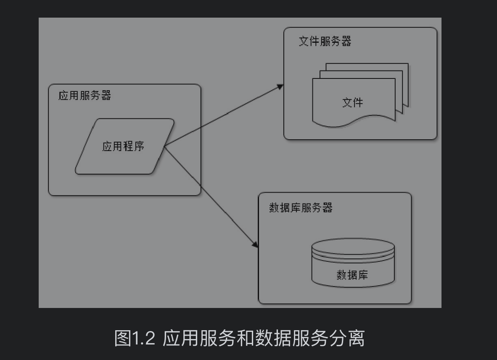
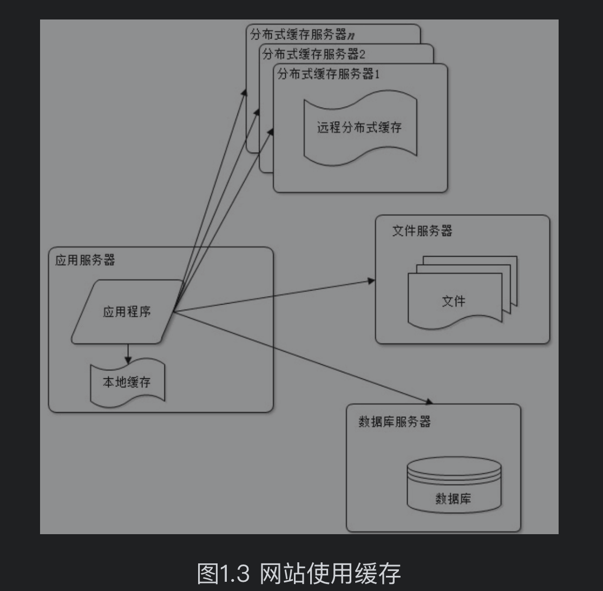
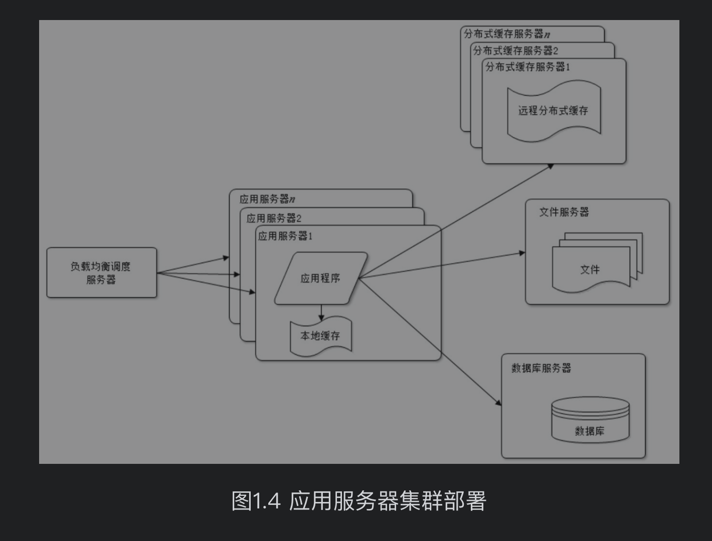

- 在学习架构时，**第一步不要去学习框架，而是要学习架构的演进**。强烈推荐李智慧老师的《大型网站技术架构》，这本书翻起来很快，对构筑你自己的体系很有帮助，本文的内容来源于它，在此基础上拓展了下。
- 大型网站架构演化发展历程
	- 1. 始阶段的网站架构
	  大型网站都是从小型网站发展而来，网站架构也是一样，是从小型网站架构逐步演化而来。小型网站最开始时没有太多人访问，只需要一台服务器就绰绰有余，这时的网站架构如图1.1所示。
	   
	  应用程序、数据库、文件等所有的资源都在一台服务器上。通常服务器操作系统使用Linux，应用程序使用PHP开发，然后部署在Apache上，数据库使用MySQL，汇集各种免费开源软件及一台廉价服务器就可以开始网站的发展之路了。
	- 2. 应用程序和数据分离
	  随着网站业务的发展，一台服务器逐渐不能满足需求：越来越多的用户访问导致性能越来越差，越来越多的数据导致存储空间不足。
	  这时就需要将应用和数据分离。应用和数据分离后整个网站使用三台服务器：应用服务器、文件服务器和数据库服务器，如图1.2所示。
	  这三台服务器对硬件资源的要求各不相同，
	  应用服务器需要处理大量的业务逻辑，因此需要更快更强大的CPU；
	  数据库服务器需要快速磁盘检索和数据缓存，因此需要更快的硬盘和更大的内存；
	  文件服务器需要存储大量用户上传的文件，因此需要更大的硬盘。
	  
	  应用和数据分离后，不同特性的服务器承担不同的服务角色，网站的并发处理能力和数据存储空间得到了很大改善，支持网站业务进一步发展。
	  新问题
	  但是随着用户逐渐增多，网站又一次面临挑战：数据库压力太大导致访问延迟，进而影响整个网站的性能，用户体验受到影响。这时需要对网站架构进一步优化。
	- 3. 使用缓存改善网站性能
	  网站访问特点和现实世界的财富分配一样遵循二八定律：80%的业务访问集中在20%的数据上。
	  淘宝买家浏览的商品集中在少部分成交数多、评价良好的商品上；
	  百度搜索关键词集中在少部分热门词汇上；
	  只有经常登录的用户才会发微博、看微博，而这部分用户也只占总用户数目的一小部分。
	  
	  既然大部分的业务访问集中在一小部分数据上，那么如果把这一小部分数据缓存在内存中，是不是就可以减少数据库的访问压力，提高整个网站的数据访问速度，改善数据库的写入性能了呢？
	  
	  网站使用的缓存可以分为两种：缓存在应用服务器上的本地缓存和缓存在专门的分布式缓存服务器上的远程缓存。本地缓存的访问速度更快一些，但是受应用服务器内存限制，其缓存数据量有限，而且会出现和应用程序争用内存的情况。远程分布式缓存可以使用集群的方式，部署大内存的服务器作为专门的缓存服务器，可以在理论上做到不受内存容量限制的缓存服务，如图1.3所示
	  
	  新问题
	  使用缓存后，数据访问压力得到有效缓解，但是单一应用服务器能够处理的请求连接有限，在网站访问高峰期，应用服务器成为整个网站的瓶颈。
	- 4. 使用应用服务器集群改善网站的并发处理能力
	  使用集群是网站解决高并发、海量数据问题的常用手段。当一台服务器的处理能力、存储空间不足时，不要企图去换更强大的服务器，对大型网站而言，不管多么强大的服务器，都满足不了网站持续增长的业务需求。这种情况下，更恰当的做法是增加一台服务器分担原有服务器的访问及存储压力。
	  
	  对网站架构而言，只要能通过增加一台服务器的方式改善负载压力，就可以以同样的方式持续增加服务器不断改善系统性能，从而实现系统的可伸缩性。应用服务器实现集群是网站可伸缩集群架构设计中较为简单成熟的一种，如图1.4所示。
	  
	  
	  通过负载均衡调度服务器，可将来自用户浏览器的访问请求分发到应用服务器集群中的任何一台服务器上，如果有更多的用户，就在集群中加入更多的应用服务器，使应用服务器的负载压力不再成为整个网站的瓶颈。
	-