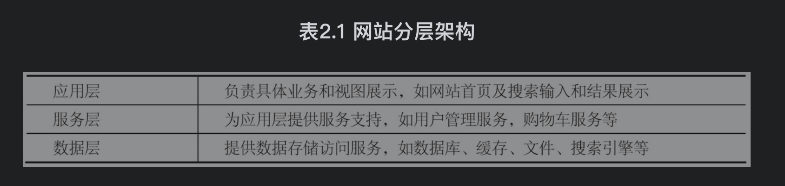

- 为了解决大型网站面临的高并发访问、海量数据处理、高可靠运行等一系列问题与挑战，大型互联网公司在实践中提出了许多解决方案，以实现网站高性能、高可用、易伸缩、可扩展、安全等各种技术架构目标。这些解决方案又被更多网站重复使用，从而逐渐形成大型网站架构模式。
- 分层
  分层是企业应用系统中最常见的一种架构模式，将系统在横向维度上切分成几个部分，每个部分负责一部分相对比较单一的职责，然后通过上层对下层的依赖和调用组成一个完整的系统。
  
  分层结构在计算机世界中无处不在，网络的7层通信协议是一种分层结构；计算机硬件、操作系统、应用软件也可以看作是一种分层结构。在大型网站架构中也采用分层结构，将网站软件系统分为应用层、服务层、数据层，如表2.1所示。
  
  通过分层，可以更好地将一个庞大的软件系统切分成不同的部分，便于分工合作开发和维护；各层之间具有一定的独立性，只要维持调用接口不变，各层可以根据具体问题独立演化发展而不需要其他层必须做出相应调整。
  但是分层架构也有一些挑战，就是必须合理规划层次边界和接口，在开发过程中，严格遵循分层架构的约束，禁止跨层次的调用（应用层直接调用数据层）及逆向调用（数据层调用服务层，或者服务层调用应用层）。
  在实践中，大的分层结构内部还可以继续分层，如应用层可以再细分为视图层（美工负责）和业务逻辑层（工程师负责）；服务层也可以细分为数据接口层（适配各种输入和输出的数据格式）和逻辑处理层。
-