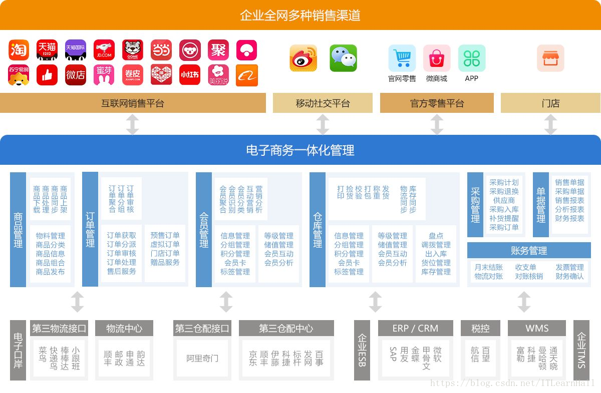
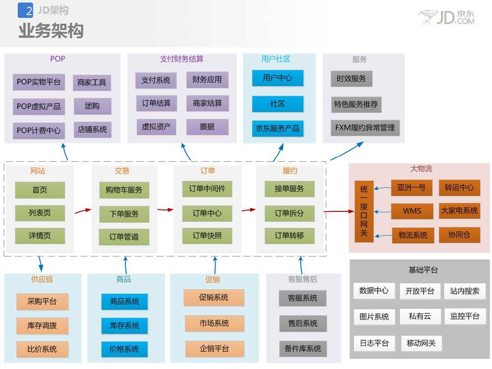

- 注意:
  很多时候架构的视角/分类没有明显的边界，通常是交叉的；
- 业务架构
  核心是解决业务带来的系统复杂性，了解客户/业务方的痛点，项目定义，现有环境；梳理高阶需求和非功能性需求，进行问题域划分与领域建模等工作；沟通，方案建议，多次迭代，交付总体架构。
  
  看看京东业务架构（网上分享图）：
  
- 应用/技术架构
  应用架构:根据业务场景的需要，设计应用的层次结构，制定应用规范、定义接口和数据交互协议等。
  并尽量将应用的复杂度控制在一个可以接受的水平，从而在快速的支撑业务发展的同时，在保证系统的可用性和可维护性的同时，确保应用满足非功能属性要求（性能、安全、稳定性等）。
  技术架构主要考虑系统的非功能性特征，对系统的高可用、高性能、扩展、安全、伸缩性、简洁等做系统级的把握。