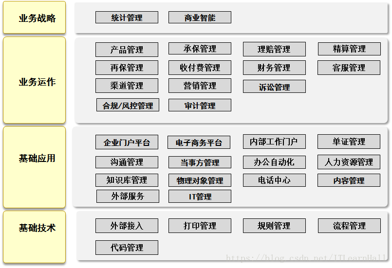
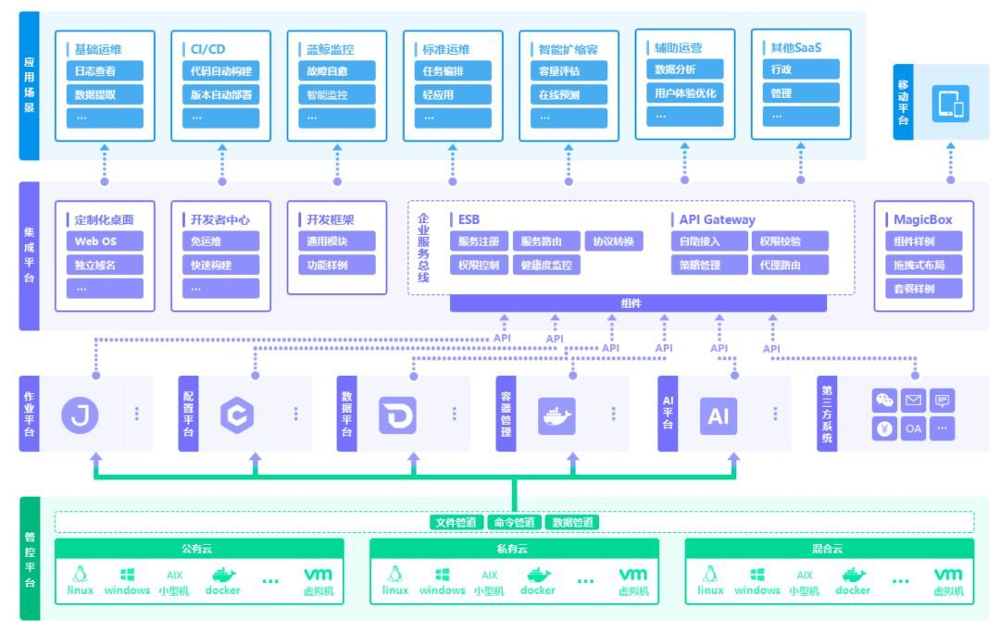
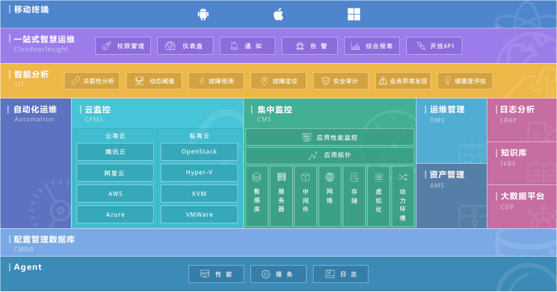
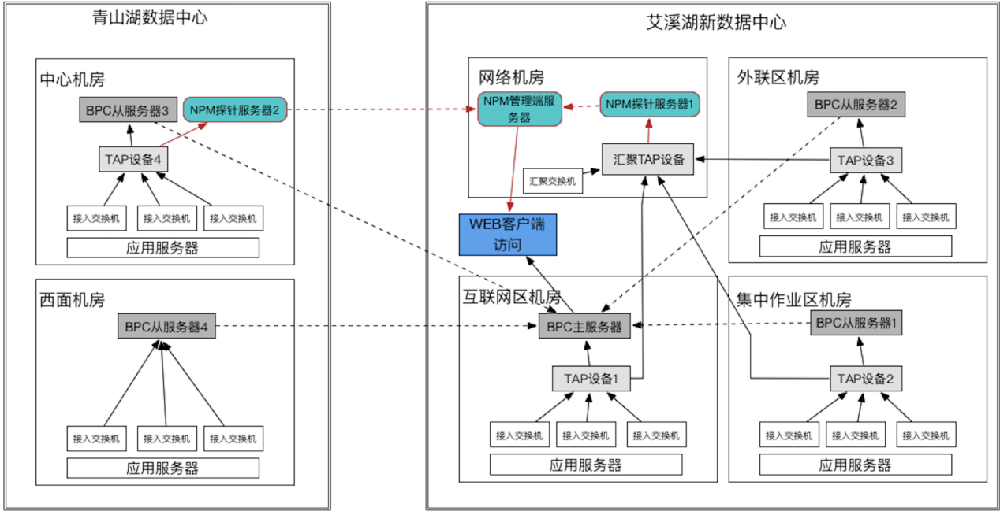
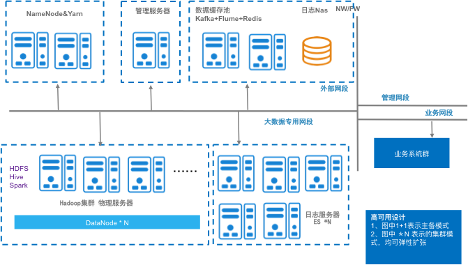

- 注意:
  很多时候架构的视角/分类没有明显的边界，通常是交叉的；
- 业务架构
  核心是解决业务带来的系统复杂性，了解客户/业务方的痛点，项目定义，现有环境；梳理高阶需求和非功能性需求，进行问题域划分与领域建模等工作；沟通，方案建议，多次迭代，交付总体架构。
  
  看看京东业务架构（网上分享图）：
  
- 应用/技术架构
  应用架构:根据业务场景的需要，设计应用的层次结构，制定应用规范、定义接口和数据交互协议等。
  并尽量将应用的复杂度控制在一个可以接受的水平，从而在快速的支撑业务发展的同时，在保证系统的可用性和可维护性的同时，确保应用满足非功能属性要求（性能、安全、稳定性等）。
  技术架构主要考虑系统的非功能性特征，对系统的高可用、高性能、扩展、安全、伸缩性、简洁等做系统级的把握。
	- 视角:功能视角
	  功能视角和业务视角有重合的地方，主要针对开发而言的服务功能；
	  
	- 技术视角:总体
	  技术框架（technological Framework）是整个或部分技术系统的可重用设计，表现为一组抽象构件及构件实例间交互的方法;
	  另一种定义认为，技术框架是可被技术开发者定制的应用骨架。前者是从应用方面而后者是从目的方面给出的定义。
	  
	  从技术层面描述，主要是分层模型，例如持久层、数据层、逻辑层、应用层、表现层等，然后每层使用什么技术框架，例如Spring、hibernate、ioc、MVC、成熟的类库、中间件、WebService等，分别说明，要求这些技术能够将整个系统的主要实现概括。
	- 技术视角:数据架构
	  专注于构建数据中台，统一数据定义规范，标准化数据表达，形成有效易维护的数据资产。打造统一的大数据处理平台，包括数据可视化运营平台、数据共享平台、数据权限管理平台等。
	- 技术视角:基础架构
	  PAAS，IAAS...
	  
	- 技术视角:运维架构
	  负责运维系统的规划、选型、部署上线，建立规范化的运维体系。
	  
	-
- 物理架构
  物理架构关注软件元件是如何放到硬件上的，专注于基础设施，某种软硬件体系，甚至云平台，包括机房搭建、网络拓扑结构，网络分流器、代理服务器、Web 服务器、应用服务器、报表服务器、整合服务器、存储服务器和主机等。
	- 银行系统为例
	  下面为业务性能及网络性能监控的物理部署架构图，分网络接入层和汇聚层两个层次对网络流量报文进行捕获和深入分析。
	  
	  物理部署架构设计说明：
	  （1）通过4台TAP设备获取青山湖和艾溪湖两个数据中心、五个机房相关应用服务器接入交换机的镜像流量，并进行规则过滤；
	  （2）通过1台高性能汇聚TAP来获取艾溪湖数据中心二层汇聚交换机和核心交换机的镜像流量，并进行规则过滤；
	  （3）艾溪湖主数据中心各机房接入层TAP设备的流量共享给汇聚TAP设备；
	  （4）BPC系统的5台BPC服务器在两个数据中心的每个机房进行分布式部署、解码和分析，并集中展示；
	  （5）NPM系统在艾溪湖数据中心部署一台管理端服务器，并在每个数据中心各部署一台NPM探针服务器，通过分布式部署、捕获数据，集中监控展示的方式，监控两个数据中心的各业务系统的网络性能；
	  （6）通过双数据中心、多机房分布式部署的方式，端到端的监控业务在各个环节的流转情况，实时监控，快速定位。
	- 下面为运维大数据平台的物理部署拓扑图，分为三个集群，Hadoop集群、ES日志集群和Kalfka消息集群。
	  
	  物理部署架构设计说明：
	  1. 配置多台服务器做Hadoop集群，满足不同应用和系统日志的单系统与跨系统交易日志统计与分析，满足数千个基础监控分区的基础性能分析与运行性能指标预测等，以及指性能标入库与历史日志数据入库的存储需要。
	  2. 配置多台服务器做ES集群，承载实时统一日志查询与分析平台的任务，满足数天至一个月不同需求的日志查询和分析需求，历史日志查询需要从HDFS中将数据导入至ES中，进行二次查询。
	  3. 配置多台服务器做Kafka集群用于实时的指标型与日志型数据流的采集，满足实时监控的需求。
	-
	-
- DDD到各种架构
-