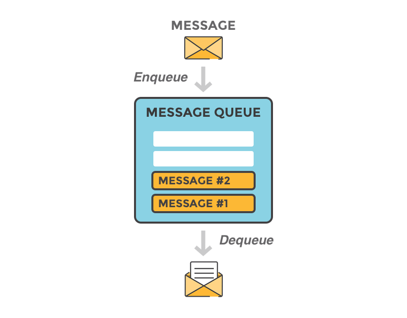
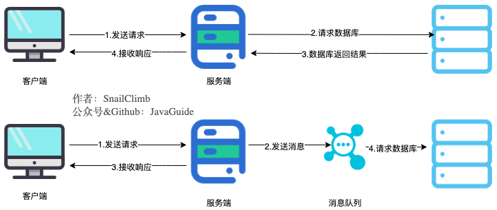
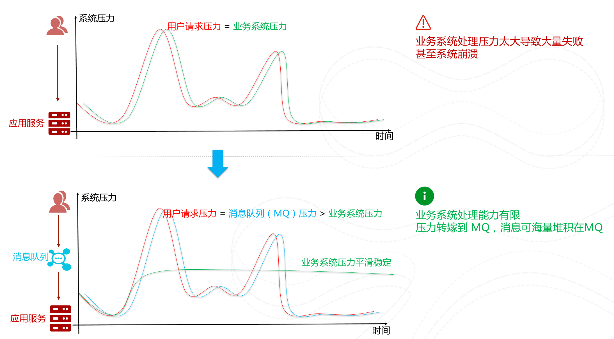
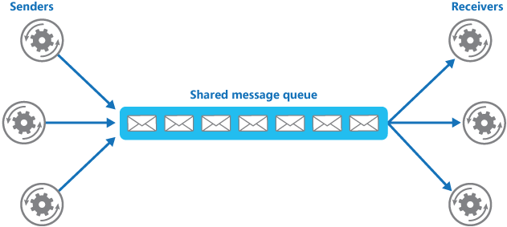

- ## 什么是消息队列
  我们可以把消息队列看作是一个存放消息的容器，当我们需要使用消息的时候，直接从容器中取出消息供自己使用即可。
   
  消息队列是分布式系统中重要的组件之一。使用消息队列主要是为了通过异步处理提高系统性能和削峰、降低系统耦合性。
  我们知道队列 Queue 是一种先进先出的数据结构，所以消费消息时也是按照顺序来消费的。
- 使用消息队列的好处
	- 1. **通过异步处理提高系统性能（减少响应所需时间）。**
	  
	  将用户的请求数据存储到消息队列之后就立即返回结果。随后，系统再对消息进行消费。
	  
	  因为用户请求数据写入消息队列之后就立即返回给用户了，但是请求数据在后续的业务校验、写数据库等操作中可能失败。因此，**使用消息队列进行异步处理之后，需要适当修改业务流程进行配合**，比如用户在提交订单之后，订单数据写入消息队列，不能立即返回用户订单提交成功，需要在消息队列的订单消费者进程真正处理完该订单之后，甚至出库后，再通过电子邮件或短信通知用户订单成功，以免交易纠纷。这就类似我们平时手机订火车票和电影票。
	- 2. **削峰/限流**
	  **先将短时间高并发产生的事务消息存储在消息队列中，然后后端服务再慢慢根据自己的能力去消费这些消息，这样就避免直接把后端服务打垮掉。**
	  业务场景举例：在电子商务一些秒杀、促销活动中，合理使用消息队列可以有效抵御促销活动刚开始大量订单涌入对系统的冲击。如下图所示：
	  {:height 598, :width 1066}
	- 3. **降低系统耦合性。**
	  使用消息队列还可以降低系统耦合性。我们知道如果模块之间不存在直接调用，那么新增模块或者修改模块就对其他模块影响较小，这样系统的可扩展性无疑更好一些。还是直接上图吧：
	  
	  生产者（客户端）发送消息到消息队列中去，接受者（服务端）处理消息，需要消费的系统直接去消息队列取消息进行消费即可而不需要和其他系统有耦合，这显然也提高了系统的扩展性。
	  
	  **消息队列使用发布-订阅模式工作，消息发送者（生产者）发布消息，一个或多个消息接受者（消费者）订阅消息。**从上图可以看到**消息发送者（生产者）和消息接受者（消费者）之间没有直接耦合**，消息发送者将消息发送至分布式消息队列即结束对消息的处理，消息接受者从分布式消息队列获取该消息后进行后续处理，并不需要知道该消息从何而来。**对新增业务，只要对该类消息感兴趣，即可订阅该消息，对原有系统和业务没有任何影响，从而实现网站业务的可扩展性设计**。
	  
	  消息接受者对消息进行过滤、处理、包装后，构造成一个新的消息类型，将消息继续发送出去，等待其他消息接受者订阅该消息。因此基于事件（消息对象）驱动的业务架构可以是一系列流程。
	  
	  另外，为了避免消息队列服务器宕机造成消息丢失，会将成功发送到消息队列的消息存储在消息生产者服务器上，等消息真正被消费者服务器处理后才删除消息。在消息队列服务器宕机后，生产者服务器会选择分布式消息队列服务器集群中的其他服务器发布消息。
- ## 使用消息队列带来的一些问题**
  1. 系统可用性降低：
  系统可用性在某种程度上降低，为什么这样说呢？在加入 MQ 之前，你不用考虑消息丢失或者说 MQ 挂掉等等的情况，但是，引入 MQ 之后你就需要去考虑了！
  2.**系统复杂性提高：**
  加入 MQ 之后，你需要保证消息没有被重复消费、处理消息丢失的情况、保证消息传递的顺序性等等问题！
  3.**一致性问题：**
  我上面讲了消息队列可以实现异步，消息队列带来的异步确实可以提高系统响应速度。但是，万一消息的真正消费者并没有正确消费消息怎么办？这样就会导致数据不一致的情况了!
- JMS
  JMS 简介
  JMS（JAVA Message Service,java 消息服务）是 java 的消息服务，JMS 的客户端之间可以通过 JMS 服务进行异步的消息传输。**JMS API 是一个消息服务的标准或者说是规范**，允许应用程序组件基于 JavaEE 平台创建、发送、接收和读取消息。它使分布式通信耦合度更低，消息服务更加可靠以及异步性。
- AMQP
## JMS VS AMQP
- 常见消息队列中间件
  [[rocketmq]]
  [[kafka]]
  [[RabbitMQ]]
-