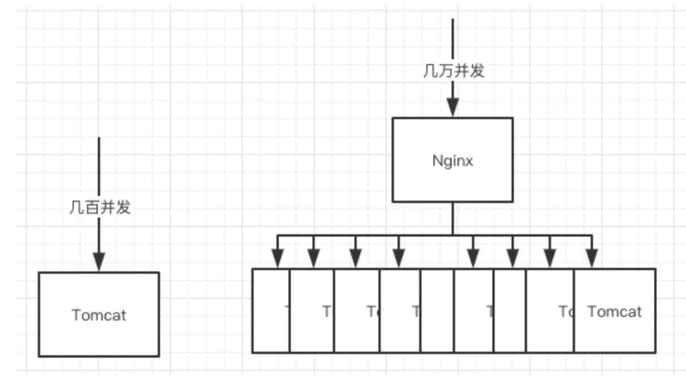

- 秒杀系统的特点
  秒杀的特点就是这样**时间极短**、**瞬间用户量大**。
  首先假设一个业务场景
  我们现场要卖1000件下面这个**婴儿纸尿裤**，然后我们根据以往这样秒杀活动的数据经验来看，目测来抢这1000件纸尿裤的人足足有10万人。
  
  这么大的流量直接打DB,DB肯定是扛不住的。
- 秒杀系统类型
  针对少量热点商品进行秒杀活动
  针对许多热点商品进行秒杀活动
- 秒杀系统需要考虑的问题
  极致性能优化
  预估秒杀流量=用户真实流量+用户狂点流量+黑客/黄牛恶意流量
	- 秒杀系统之高并发问题
	  这个是我们想都不用想的一个点，一瞬间这么多人进来这不是高并发什么时候是呢？
	  秒杀的特点就是这样**时间极短**、**瞬间用户量大**。
	  流量分析:
	  秒杀大家都知道如果真的营销到位，价格诱人，几十万的流量我觉得完全不是问题，那单机的**Redis**我感觉3-4W的QPS还是能顶得住的，但是再高了就没办法了，那这个数据随便搞个热销商品的秒杀可能都不止了。
	  缓存对应的问题都是需要考虑的:**缓存雪崩**，**缓存击穿**，**缓存穿透**，缓存预热
	- 秒杀系统之商品超卖问题
	  但凡是个秒杀，都怕**超卖**
	- 秒杀系统之恶意请求
	  秒杀活动,用户知道，你知道，别的别有用心的人（黑客、黄牛...）肯定也知道的。
	  
	  黑客/黄牛的方案
	  那简单啊，我知道你什么时候抢，我搞个几十台机器搞点脚本，我也模拟出来十几万个人左右的请求，那我是不是意味着我基本上有80%的成功率了。
	  真实情况可能远远不止，因为机器请求的速度比人的手速往往快太多了
	  --->会平白无故得增加大量无效流量
	  
	  >Tip：科普下，小道消息了解到的，黄牛的抢票系统，比国内很多小公司的系统还吊很多，架构设计都是顶级的，我用**顶配的服务**加上**顶配的架构设计**
	- 秒杀系统之链接暴露
	  相信是个开发同学都对这个画面一点都不陌生吧，懂点行的仔都可以打开谷歌的**开发者模式**，然后看看你的网页代码，有的就有URL，但是我写VUE的时候是事件触发然后去调用文件里面的接口看源码看不到，但是我可以点击一下**查看你的请求地址**啊，不过你好像可以对按钮在秒杀前置灰。
	  
	  不管怎么样子都有危险，撇开外面的所有的东西你都挡住了，你卖这个东西实在便宜得过分，有诱惑力，你能保证**开发不动心**？开发知道地址，在秒杀的时候自己提前请求。。。（开发：怎么TM又是我）
	- 秒杀系统之数据库抗压
	  每秒上万甚至十几万的**QPS**（每秒请求数）直接打到**数据库**，基本上都要把库打挂掉，而且如果你服务不单单是做秒杀的还涉及其他的业务，你没做**降级、限流、熔断**啥的，别的一起挂，小公司的话可能**全站崩溃404**。
	  反正不管你秒杀怎么挂，你别把别的搞挂了
	-
- 秒杀系统的一种架构图
  {:height 1006, :width 1080}
- 整体设计方案
  明确设计目标:预计秒杀峰值流量--->整体设计方案--->通过压测来评估是否到达设计目标
  集群部署
  
  服务单一职责：隔离:
  秒杀作为单独的服务进行设计
  如果可能的话,尽可能和业务系统完全隔离开来(从前端到后端整个链路)
  nginx,网管
  秒杀服务单独部署,redis,消息队列,数据库也可以单独设计
- 具体分层设计方案
  设计的秒杀系统从上到下去给大家介绍正常电商秒杀系统在每一层做了些什么，每一层存在的问题，难点等。
	- 前端
	  秒杀系统普遍都是商城网页、H5、APP、小程序这几项。
		- CDN(资源静态化)
		  秒杀一般都是特定的商品还有页面模板，现在一般都是前后端分离的，页面一般都是不会经过后端的，但是前端也要自己的服务器啊，那就把能提前放入**cdn服务器**的东西都放进去，反正把所有能提升效率的步骤都做一下，减少真正秒杀时候服务器的压力。
		- 秒杀链接加盐
		  时间校验
		  链接要是提前暴露出去可能有人直接访问url就提前秒杀了，那又有小伙伴要说了我做个时间的校验就好了呀，那我告诉你，知道链接的地址比起页面人工点击的还是有**很大优势**。
		  
		  黑客/黄牛
		  我知道url了，那我通过程序不断获取最新的北京时间，可以达到**毫秒级别**的，我就在00毫秒的时候请求，我敢说绝对比你人工点的成功率大太多了，而且我可以一毫秒发送N次请求，搞不好你卖100个产品我全拿了。
		  
		  那该如何处理呢
		  简单，把**URL动态化**，就连写代码的人开发都不知道秒杀链接，你就通过MD5之类的摘要算法加密随机的字符串去做url，然后通过前端代码获取url后台校验才能通过。
		  URL动态化设计思路
		  在获取秒杀URL的接口中，返回一个服务器端生成的随机数，并在下单URL中传递该参数完成下单。
		  ```
		  public class Exposer {
		  
		  
		      //加密措施
		      private String md5;
		  
		      //其中必要字段，如是否开启秒杀，时间等省
		  }
		  //Controller
		  @RequestMapping(value = "/{goodsId}/getUrl")
		      public Exposer exposer(@PathVariable("goodsId") Long seckillGoodsId)
		      {
		      //goodsId表示是什么商品，然后根据该商品的数据库依次获得尚未被秒杀的每个商品的唯一ID，然后根据商品的唯一ID来生成唯一的秒杀URL
		      seckillGoodsId为某个商品的唯一id
		  其中这一步可以省，之间将goodsId表示的传递给exportSeckillUrl也可以完成
		      //异常判断省掉，返回上述的model对象。即包含md5的对象
		              Exposer result =seckillService.exportSeckillUrl(seckillGoodsId);
		              return result;
		      }
		  //Service的方法实现:
		  //加入一个混淆字符串(秒杀接口)的salt，为了我避免用户猜出我们的md5值，值任意给，越复杂越好
		  private final String salt="12sadasadsafafsafs。/。，";
		  
		  public Exposer exportSeckillUrl(long seckillGoodsId) {
		        //首页根据该seckillGoodsId判断商品是否还存在。
		        //如果不存在则表示已经被秒杀
		        String md5 = getMD5(seckillGoodsId);
		        return  new Exposer(md5);
		  }
		  
		    private String getMD5(long seckillGoodsId)
		      {
		          //结合秒杀的商品id与混淆字符串生成通过md5加密
		          String base=seckillGoodsId+"/"+salt;
		          String md5= DigestUtils.md5DigestAsHex(base.getBytes());
		          return md5;
		      }
		  
		  ```
		  用户在获取获取到下单URL的时候，当秒杀开启后则会得到一个md5值。通过该md5值来完成下单具体的秒杀交易:
		  ```
		  //controller
		  @RequestMapping(value = "/{seckillGoodsId}/{md5}/execution")
		      public Boolean execution(@PathVariable("seckillGoodsId") Long seckillGoodsId,@PathVariable("md5") String md5){
		              Boolean result = seckillService.executionSeckillId(seckillId,md5);
		              //executionSeckillId的操作是强事务,操作为减库存+增加购买明细，最终返回是否秒杀成功，秒杀成功的商品消息等。这里省，只返回是否接口合理的信息。
		              return  result;
		      }
		  //service
		  public Boolean executionSeckillId(long seckillID,String md5){
		        if(md5==null||!md5.equals(getMD5(seckillID))){
		           //表示接口错误，不会执行秒杀操作
		           return false;
		        }
		        //接口正确，排队执行秒杀操作。减库存+增加购买明细等信息，这里只返回false
		        return  true;
		      }
		  }
		  ```
		  这个只能防止一部分没耐心继续破解下去的黑客，有耐心的人研究出来还是能破解，在电商场景存在很多这样的羊毛党，那怎么做呢？
		  作者后面说
		- 前端限流
		  限流可以分为前端限流和后端限流
		  1. 物理控制:
		  a.秒杀活动开启前按钮置灰
		  需要前端的配合，定时去请求你的后端服务器，获取最新的北京时间，到时间点再给按钮可用状态。
		  b.点击后按钮也置灰几秒(防止多次连续点击)
	- nginx集群
	  **Nginx**大家想必都不陌生了吧，这玩意是**高性能的web服务器**，并发也随便顶几万不是梦，部署个nginx集群
	- 网关集群部署
	  1. 后端限流
	  限流组件加入进来,阿里的Sentinel、Hystrix等，
	  我们卖1000件商品，请求有10W，我们不需要把十万都放进来，你可以放1W请求进来，然后再进行操作，因为秒杀对于用户本身就是黑盒的，所以你怎么做的他们是没感知的，至于为啥放1W进来，而不是刚好1000，是因为会丢掉一些薅羊毛的用户(恶意流量)，至于怎么判断，后面的风控阶段我会说。
	  2. 针对恶意请求网关层就进行拦截
	  不然请求多了他抢不抢得到是一回事，服务器压力上去了，可能占用网络带宽或者把**服务器打崩、缓存击穿**等等。
	  拦截规则可以是:同一个用户/ip单位时间内请求次数过多则网管层直接拦截掉
	- 风控
	  前面的所有措施还是拦不住很多羊毛党，因为他们是专业的团队，他们可以注册很多账号来薅你的羊毛，而且不用机器请求，就用群控，操作几乎跟真实用户一模一样。
	  在请求到达后端之前，风控可以根据账号行为分析出这个账号机器人的概率大不大，我现在负责公司的某些特殊系统，每个用户的行为都是会送到我们大数据团队进行分析处理，给你打上对应标签的。
	  那黑客其实也有办法：**养号**
	  他们去黑市买真实用户有过很多记录的账号，买到了还不闲着，帮他们去购物啥的，让系统无法识别他们是黑号还是真实用户的号。
	  **怎么办？**
	  通杀！是的没有办法，只能通杀了，通杀的意思就是，我们通过风管分析出来这个用户是真实用户的概率没有其他用户概率大，那就认为他是机器了，丢弃他的请求。
	  之前的限流我们放进来10000个请求，但是我们真正的库存只有1000个，那我们就算出最有可能是真实用户的1000人进行秒杀，丢弃其他请求，因为秒杀本来就是黑盒操作的，用户层面是无感知的，这样设计能让真实的用户买到东西，还可以减少自己被薅羊毛的概率。
	  风控可以说是流量进入的最后一道门槛了，所以很多公司的风控是很强的，蚂蚁金服的风控大家如果了解过就知道了，你的资金在支付宝被盗了，他们是能做到全款补偿是有原因的。
	- 秒杀服务集群部署
	  但是我们的**Tomcat**只能顶几百的并发呀，那简单呀**负载均衡**嘛，一台服务几百，那就多搞点，在秒杀的时候多租点**流量机**。
	  
	- 后端限流
	- 后端
	  服务单一职责：
	  后端业务层面
	  1. 售卖结束的话,针对后续请求秒杀服务直接返回false，,告知前端“已售罄"
	- redis
	- 消息队列
	- 数据库
- 资料
  [敖丙带你设计【秒杀系统】](https://mp.weixin.qq.com/s/KWb3POodisbOEsQVblsoGw)
-