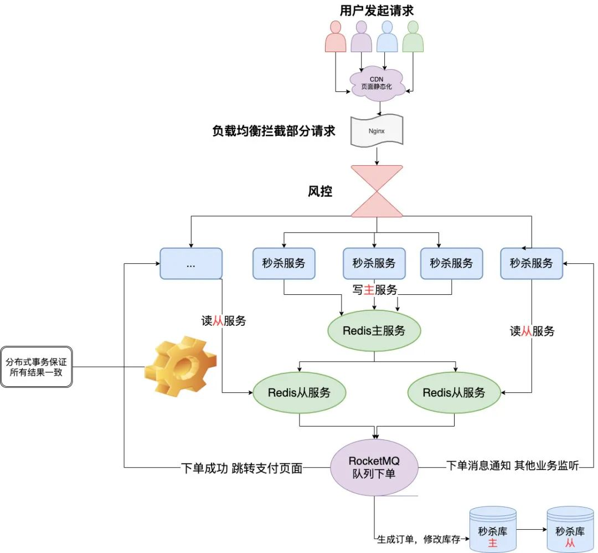

- 秒杀系统的特点
  秒杀的特点就是这样**时间极短**、**瞬间用户量大**。
  首先假设一个业务场景
  我们现场要卖1000件下面这个**婴儿纸尿裤**，然后我们根据以往这样秒杀活动的数据经验来看，目测来抢这1000件纸尿裤的人足足有10万人。
  
  这么大的流量直接打DB,DB肯定是扛不住的。
- 秒杀系统类型
  针对少量热点商品进行秒杀活动
  针对许多热点商品进行秒杀活动
- 秒杀系统需要考虑的问题
  预估秒杀流量=用户真实流量+用户狂点流量+黑客/黄牛恶意流量
	- 秒杀系统之高并发问题
	  这个是我们想都不用想的一个点，一瞬间这么多人进来这不是高并发什么时候是呢？
	  秒杀的特点就是这样**时间极短**、**瞬间用户量大**。
	  流量分析:
	  秒杀大家都知道如果真的营销到位，价格诱人，几十万的流量我觉得完全不是问题，那单机的**Redis**我感觉3-4W的QPS还是能顶得住的，但是再高了就没办法了，那这个数据随便搞个热销商品的秒杀可能都不止了。
	  缓存对应的问题都是需要考虑的:**缓存雪崩**，**缓存击穿**，**缓存穿透**，缓存预热
	- 秒杀系统之商品超卖问题
	  但凡是个秒杀，都怕**超卖**
	- 秒杀系统之恶意请求
	  秒杀活动,用户知道，你知道，别的别有用心的人（黑客、黄牛...）肯定也知道的。
	  
	  黑客/黄牛的方案
	  那简单啊，我知道你什么时候抢，我搞个几十台机器搞点脚本，我也模拟出来十几万个人左右的请求，那我是不是意味着我基本上有80%的成功率了。
	  真实情况可能远远不止，因为机器请求的速度比人的手速往往快太多了
	  --->会平白无故得增加大量无效流量
	  
	  >Tip：科普下，小道消息了解到的，黄牛的抢票系统，比国内很多小公司的系统还吊很多，架构设计都是顶级的，我用**顶配的服务**加上**顶配的架构设计**
	- 秒杀系统之链接暴露
	  相信是个开发同学都对这个画面一点都不陌生吧，懂点行的仔都可以打开谷歌的**开发者模式**，然后看看你的网页代码，有的就有URL，但是我写VUE的时候是事件触发然后去调用文件里面的接口看源码看不到，但是我可以点击一下**查看你的请求地址**啊，不过你好像可以对按钮在秒杀前置灰。
	  
	  不管怎么样子都有危险，撇开外面的所有的东西你都挡住了，你卖这个东西实在便宜得过分，有诱惑力，你能保证**开发不动心**？开发知道地址，在秒杀的时候自己提前请求。。。（开发：怎么TM又是我）
	- 秒杀系统之数据库抗压
	  每秒上万甚至十几万的**QPS**（每秒请求数）直接打到**数据库**，基本上都要把库打挂掉，而且如果你服务不单单是做秒杀的还涉及其他的业务，你没做**降级、限流、熔断**啥的，别的一起挂，小公司的话可能**全站崩溃404**。
	  反正不管你秒杀怎么挂，你别把别的搞挂了
	-
- 秒杀系统的一种架构图
  {:height 1006, :width 1080}
- 分层设计方案
  设计的秒杀系统从上到下去给大家介绍正常电商秒杀系统在每一层做了些什么，每一层存在的问题，难点等。
	- 前端
	  秒杀系统普遍都是商城网页、H5、APP、小程序这几项。
		- CDN(资源静态化)
		  秒杀一般都是特定的商品还有页面模板，现在一般都是前后端分离的，页面一般都是不会经过后端的，但是前端也要自己的服务器啊，那就把能提前放入**cdn服务器**的东西都放进去，反正把所有能提升效率的步骤都做一下，减少真正秒杀时候服务器的压力。
		- 秒杀链接加盐
		  时间校验
		  链接要是提前暴露出去可能有人直接访问url就提前秒杀了，那又有小伙伴要说了我做个时间的校验就好了呀，那我告诉你，知道链接的地址比起页面人工点击的还是有**很大优势**。
		  
		  黑客/黄牛
		  我知道url了，那我通过程序不断获取最新的北京时间，可以达到**毫秒级别**的，我就在00毫秒的时候请求，我敢说绝对比你人工点的成功率大太多了，而且我可以一毫秒发送N次请求，搞不好你卖100个产品我全拿了。
		  
		  那该如何处理呢
		  简单，把**URL动态化**，就连写代码的人开发都不知道秒杀链接，你就通过MD5之类的摘要算法加密随机的字符串去做url，然后通过前端代码获取url后台校验才能通过。
		  URL动态化设计方案
		  
		  这个只能防止一部分没耐心继续破解下去的黑客，有耐心的人研究出来还是能破解，在电商场景存在很多这样的羊毛党，那怎么做呢？
		  作者后面说
	- nginx
	- 后端
	- redis
	- 消息队列
	- 数据库
- 资料
  [敖丙带你设计【秒杀系统】](https://mp.weixin.qq.com/s/KWb3POodisbOEsQVblsoGw)
-