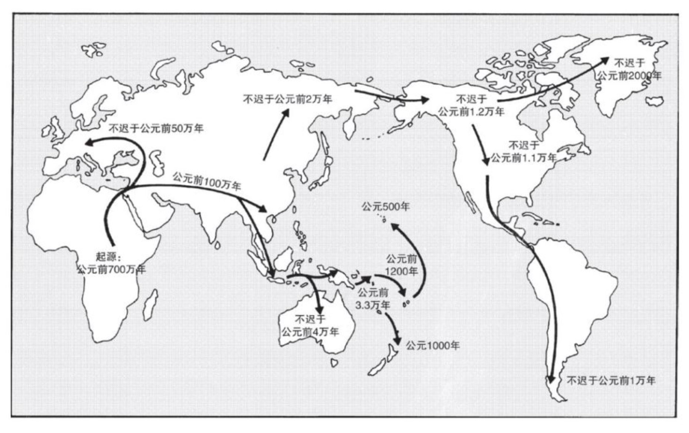

- 公元前11000年前左右是一个比较合适的时间点.最近的冰河期正好结束，进入地质学家所说的全新世[维基百科 全新世](https://zh.m.wikipedia.org/zh-hans/%E5%85%A8%E6%96%B0%E4%B8%96)。
- 主要内容：进行一场人类历史的旋风之旅，从数百万前的人类起源讲起,一直讲到13000年前。主要关注和本书相关的部分.
- 化石证据表明，人类起源于非洲，
  人类关系最近的亲戚:大猩猩，黑猩猩，倭黑猩猩
  大约700万年前左右(学者的估计在900万前-500万前左右，这只是一个大概的时间范围)，一群非洲猿划分为几个群体,一支为大猩猩，一支演化成两种黑猩猩，一支演化成人类。
  --->400年万前直系祖先直立起来--->250万年前石器已经出现--->火的使用
- 非洲南方古猿--->能人--->直立人--->50万年前智人--->非洲，欧洲西部(尼安德特人)，东亚,人类出现细化--->5万年前，人类出现跳跃式演化
  主要分析化石，头盖骨，
  智人头骨与现代人已相当相似。
  尼安德特人：神奇的一点是脑容量比现代人还略大一点，相比非洲智人更为强壮。
  10万年前的非洲智人：石器简陋；捕猎技巧不高超，只能捕食温顺动物，不具备捕食大型猛兽的能力；也不会捕鱼(遗址中找不到鱼骨和鱼钩)；没有艺术品。
  5万年前(跳跃式演化时期)：出现固定形式的石器，骨器，和装饰品，艺术品(壁画，雕像等)；工具种类繁多，针、锥子、雕刀等，有鱼叉、射矛器、弓箭等武器，使得安全距离之外捕杀大型猛兽成为可能，(火只能用来驱赶猛兽，无法做到猎杀时刻)。
  
  >在非洲东部出土了固定形制的石器和保存下来最早的装饰品（鸵鸟蛋壳磨成的串珠），这是该时期的第一批明确证据
- 更重要的是，为什么会有这次人类跳跃式演化？
  人类语言产生了。沟通交流的重要性.人类简史一书中也提到过。
  化石证据：喉头是关键，
- 另一个问题是这种跳跃式演化究竟是发现在一个地区然后向世界其他地方扩散并取代其他地区的人群，还是世界各地都发生了这种跳跃式演化呢？
  第一种主张非洲是跳跃式演化的发源地。()
  第二种主张多个地区平行演化，
  目前还没有定论。
  >“现代人类起源于某个地区，然后扩散并取代其他地区的人类种群”这个理论，在欧洲的证据看起来最强。大约4万年前，克罗马农人来到欧洲，他们的形态接近现代人类，武器先进，还有其他进步的文化特征。不到几千年，已在欧洲生活了几十万年的尼安德特人就消失了，而原本他们是欧洲唯一的人类种群。从事情发生的顺序看，很有可能是克罗马农人凭借先进的技术、语言能力或脑力，杀害或取代了尼安德特人——几乎没有证据显示这两种人曾经混血。
  
  >第一批走出非洲的人类祖先是直立人,其化石证据是在东南亚的爪哇岛发现的“爪哇人”（Java man）。过去学者推断，最古老的爪哇人化石（Homo erectus）的年代在约100万年前
- 人类在全世界的地理扩展示意图
  跳跃式演化后人类在全世界的地理扩展,不迟于公元前4万年澳大利亚--->不迟于公元前3.3万年新几内亚--->不迟于公元前2万年西伯利亚--->不迟于公元前1.2万年前美洲北部--->不迟于公元前1.1万年美国--->不迟于公元前1万年南美洲大陆最南端--->南极洲那是近代几百年间的故事了
-
- 图中的不迟于表明最早发现的化石证据所处年代，实际情况有可能更早。
  
-
-
-