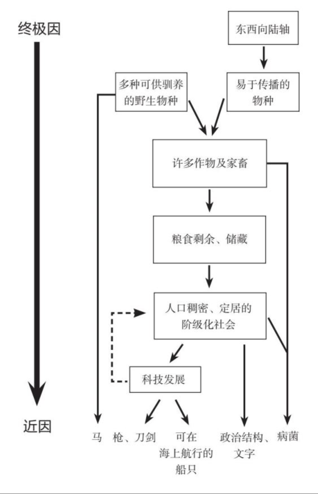

- 食物生产对枪炮病菌与钢铁的发展而言，是前提条件。本章节讨论食物生产与种种优势的关联关系。
- 食物生产者与狩猎采集者相比较
  越多的卡路里--->养活越多的人
  
  病菌与驯养的动植物的关系
  主要分析食物生产与种种优势的关联关系
  	很多可供驯养的野生物种
  		野生物种上携带的病菌更容易在人类间传播，进化
  			人类对病菌逐步产生免疫力
  		相同单位土地食物生产相比狩猎-采集可以产出更多的卡路里
  			更多食物
  				可以养活更多的人类(10-100倍)
  					狩猎采集不定居生活转向定居生活
  						相比狩猎采集生活
  							妇女生育间期缩短
  								可以孕育更多的孩子
  							可以存储更多粮食
  								定期迁移生活无法随身携带更多的食物，孩子
  					人口密度增加
  						经济更加分工细化
  							更多专业人才
  								技术发展
  						更高级的政治组织
  		家畜
  			用途
  				
  		农作物
  			提供温暖的衣物，有用的物品
  	东西向陆轴
  		物种更易传播推广
- 家畜的用途分析
  肉
  					动物蛋白质来源
  				奶
  					乳品和黄油、奶酪、酸奶等乳制品的来源
  				犁地
  					铁犁牛耕是中国春秋战国农耕技术进步的重要表现
  					开恳更多的荒地
  						人力之前无法开恳的荒地，用家畜力更容易开恳出来
  					犁耕过的土地生产的农作物产量更高
  				肥料
  					家畜的粪便是农作物生产的重要肥料
  						现代社会主要是化学肥料，但是在古代主要是生物肥料
  				运输工具
  					物资交换
  				军事
  					马，骆驼 
  						快速移动
  						马 ,马鞍马镫的发明
  				提供温暖的衣物，有用的物品
  					蚕丝,纤维，毛皮大衣
-
- 定居生活与狩猎采集生活的比较
  定居生活人口密度更高,妇女生育间期更短,可以存储更多的食物.
  >田园附近人口密集，妇女的生育间隔也将变短。狩猎—采集社会中的母亲，在营地迁徙之时只能带着一个孩子和几样随身物品，除非孩子大到走得很快，跟得上族人的脚步，否则难以再生养下一个孩子。流动的狩猎—采集族群的小孩，兄弟姊妹的年龄差距大概是4岁，这多半是因为大人利用哺乳期闭经、禁欲、杀婴或是堕胎而控制了生育。而定居的族群无须携带幼子长途跋涉，因此生养无数。一般农人的生育间隔是两年，约为狩猎—采集族群的一半。由于农业社群的高生育率，加上每英亩土地可以供养的人多很多，人口自然要比狩猎—采集社群稠密。
- 历史普遍模式背后的因素图
  食物生产与种种优势的关联关系汇总图
  图中最下方列举的近因都是西班牙殖民者皮萨罗能战胜印加帝国俘虏皇帝阿塔瓦尔帕事件的影响因素 ((628f3f21-c479-4372-97ac-151cc0bbab8f)) 
  