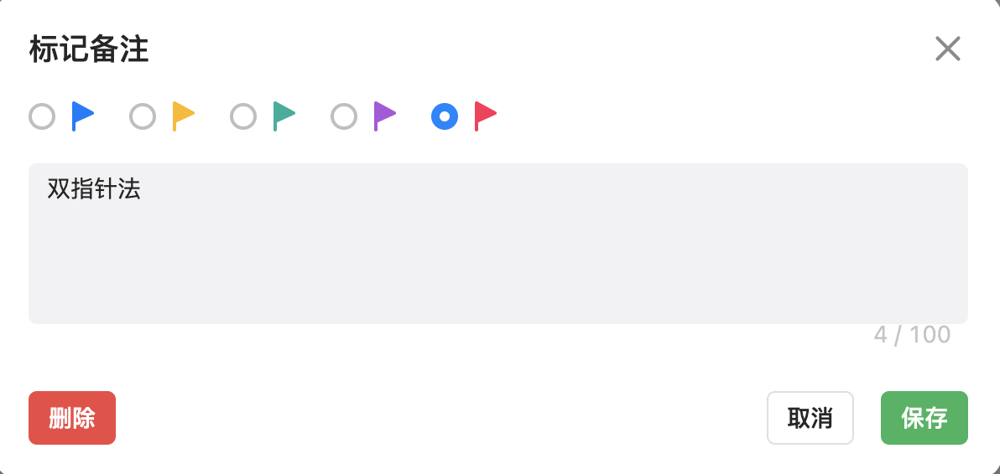

- # 基本思想
  时间复杂度On
  空间复杂度Kn
  摊还复杂度:
  循环不变量
	- ## 算法解题思路
	  1.明确算法问题描述
	  入参数据结构
	  反参数据结构
	  2.一定要能用自然语言清晰明了的描述算法结题步骤
	  3.用程序语言清楚描述算法结题步骤
	  4.采用合适的算法套路，例如递归法，回溯法等等
- # 常见算法套路
	- 分治法
	- ## 递归法
		- 递归算法三要素
		  1. 确定递归函数的参数和返回值类型。方法需要哪些值，就考虑将其作为入参。
		  2. 确定终止条件。不然操作系统栈就会无限递归下去,发生栈溢出错误。
		  3. 确认单层递归逻辑.由大而小，逐步缩小范围。重复调用自身递归
		- **递归算法一定可以转化为迭代方式(非递归方式)**
		  因为递归的本质是基于栈数据结构实现的。
		  递归的调用就是把函数的局部变量，参数值，返回地址形成栈帧结构压入调用栈中，
		  等递归完成返回的时候，再从调用栈顶中弹出栈帧
		- 资料
		  [二叉树的递归遍历](https://programmercarl.com/%E4%BA%8C%E5%8F%89%E6%A0%91%E7%9A%84%E9%80%92%E5%BD%92%E9%81%8D%E5%8E%86.html)
	- 回溯法: (剪枝函数)，回溯法解决的问题都可以抽象为树形结构
	- 深度遍历
	- 广度遍历
- # [[排序]]
- # 特殊方法
	- 二分查找:写算法的时候弄清楚区间范围的定义是算法过程中的循环不变量。自然就能写好判断条件了。
	  [left,right]左闭右闭,[left,right)左闭右开，主要这是两个写法
	- 双指针法
- 队列
  用栈实现队列:
  算法思路:用两个栈模拟队列，一个入栈,一个出栈
  [232用栈实现队列版本](https://leetcode.cn/problems/implement-queue-using-stacks/)
  {:height 536, :width 662}
- 栈
  用队列实现栈
- 哈希表
- # [[二叉树]]
	-
# 贪心算法
- # 动态规划
-
- # 图
- leetcode
  关于leetcode标注备注说明
  个人使用经验:使用不同的颜色标记不同的算法类型
  红色旗帜表示:这是一种成熟的算法思路
  
- 资料
  [代码随想录](https://programmercarl.com/)
  [可视化算法网站 algorithm-visualizer](https://algorithm-visualizer.org/brute-force/shellsort)
- 分布式算法
- 一致性hash算法
-