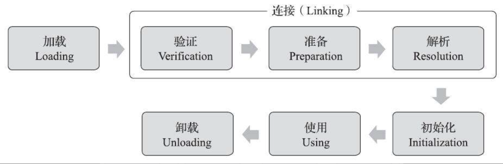

- 类的生命周期
  虚拟机的类加载机制是在运行期动态加载完成的。-->Applet,JSP,OSGI等技术
  类的生命周期7个阶段:加载,验证,准备,解析,初始化,使用,卸载。
  (联想:结合一个具体编写的类的生命周期是怎样的)
  
  关于前面5个步骤顺序认知的描述：开始顺序是严格按照图所示，并不是严格链式执行过程,交替进行，并行状态，但是结束时间不是严格按照图进行
  例如:
  1. 加载阶段与连接阶段的部分动作（如一部分字节码文件格式验证动作）是交叉进行的
  2. 解析阶段可能在初始化阶段之后，这是为了支持Java语言的运行时绑定特性（也称为动态绑定或晚期绑定）
	- id:: 628c9f32-fbad-425b-af19-80b7434d5b2c
- 类加载过程
  5个过程目的及其主要作用分析
	- 加载(Loading)
		- 主要工作任务
		  1）通过一个类的全限定名来获取定义此类的二进制字节流。
		  2）将这个字节流所代表的静态存储结构转化为方法区的运行时数据结构。
		  3）在内存中生成一个代表这个类的java.lang.Class对象，作为方法区这个类的各种数据的访问入口
		  
		  类全限定名--->获取二进制字节流(静态存储结构)--->方法区运行时数据结构--->产生Class对象,作为访问内存中存在的类入口
		  
		  关于第一点获取二进制字节流，java虚拟机规范并没有做特殊要求,如何获取二进制字节流,从哪儿获取二进制字节流都没有限制。
		  各种各样的获取应用方式,  联系
		  从ZIP压缩包获取--->JAR,WAR格式的基础
		  从网络中获取--->Applet的应用.
		  运行时计算生成--->动态代理技术,JDK Proxy代理生成，字节码技术
		  由特殊文件产生--->JSP文件生成类，加密文件
		  
		  加载阶段是整个类加载过程中开发人员可控性最强的阶段。
		  开发人员可以指定类加载器,也可以通过自定义类加载器控制类的获取方式(重写findClass()或loadClass()方法)
		- 数组类本身不通过类加载器创建，它是由Java虚拟机直接在内存中动态构造出来的。
		-
	- 验证
	  目的：安全性目的:保证二进制字节流信息完全符合《java虚拟机规范》的全部约束要求。
	  主要分成4大类验证:
		- 1. 文件格式验证:验证字节流是否符合Class文件格式的规范
		  例如版本号验证
		- 2. 元数据验证
		  例如是否继承了不被允许继承的类(final修饰)
		- 3. 字节码验证
		  一大推细节这儿就不列举了
		- 4. 符号引用验证：发生在第三个阶段解析阶段：符号引用转化为直接引用的时候。
		  例如符号引用中通过字符串描述的全限定名是否能找到对应的类，字段，方法等。
		  典型错误：NoSuchMethodError(最常见)，IllegalAccessError、NoSuchFieldError。
		- 第一个阶段验证二进制字节流本身,保证能够正确解析存储到内存方法区数据结构上
		  后面的三个验证阶段全部是基于方法区的存储结构上进行的，不会再直接读取、操作字节流了。
	- 准备:
	  目的：为类中定义的变量(statis修饰)初始化变量默认值，
	  当然不包括实例变量(这儿还没有实例对象呢)
	  ```java
	  private static int value =123;
	  ```
	  value在准备阶段值为0而非123,赋值123是putstatic指令在类构造器<clinit>方法中执行，初始化阶段才执行。
	  ```java
	  private static final int INIT_VALUE=123;
	  ```
	  当然这种特殊情况,编译时期Javac将会为value生成ConstantValue属性，在准备阶段虚拟机就会根据Con-stantValue的设置将value赋值为123。(编译器优化，类初始化时机提到) ((628de9ba-8b1c-4e7d-8d4a-e143dc04d4b2))
	- 解析
	  目的:虚拟机将符号引用转换为直接引用。
	  符号引用定义:(Class文件格式中描述),以一组符号描述所引用的目标。
	  符号可以是任何形式的字面量，唯一要求无歧义。符号引用和虚拟机实现的内存布局无关。
	  例如Class文件格式中定义的CONSTANT_Class_info、CONSTANT_Fieldref_info、CONSTANT_Methodref_info等常量
	  
	  直接引用定义:可以是直接指向目标的指针，相对偏移量或者是间接定位到目标的句柄。
	  直接引用和虚拟机实现的内存布局有关。
		- 解析动作主要针对类或接口、字段、类方法、接口方法、方法类型、方法句柄和调用点限定符这7类符号引用进行.
		  分别对应于常量池的CONSTANT_Class_info、CON-STANT_Fieldref_info、CONSTANT_Methodref_info、CONSTANT_InterfaceMethodref_info、CONSTANT_MethodType_info、CONSTANT_MethodHandle_info、CONSTANT_Dyna-mic_info和CONSTANT_InvokeDynamic_info 8种常量类型.
		  后面4种和动态语言相关.--->可以基于jvm的动态语言，例如Scale, Groovy (Kotlin不是动态语言)
			- 类或接口的解析：
			- 字段解析：
			  先对字段所属类或接口符号引用(定义在字段表内class_index项中索引的CONSTANT_Class_info)进行解析,  
			  从下往上递归查找。
			  异常：java.lang.NoSuchFieldError，java.lang.IllegalAccessError
			  Javac编译器将提示“The field Sub.A is ambiguous”，并且会拒绝编译这段代码(父类或者接口中有相同名称的字段)
			- 方法解析:
			  先对方法所属类或接口符号引用(定义在方法表内class_index项中索引的CONSTANT_Class_info)进行解析,
			  从下往上递归查找。
			  常见异常：java.lang.NoSuchMethodError, java.lang.IllegalAccessError
			- 接口方法解析:
			  先对接口方法所属接口符号引用(定义在接口方法表内class_index项中索引的CONSTANT_Class_info)进行解析,
			  从下往上递归查找。
			  常见异常：java.lang.NoSuchMethodError, java.lang.IllegalAccessError
			-
		-
	- 初始化
	  目标：初始化类变量和其他资源。其实就是执行<clinit>()类构造器(java编译器自动生成的)里的内容.
	  
	  虚拟机才真正执行应用程序编写的程序.第一个执行的类构造器是Object的类构造器。
		- <clinit>()类构造器方法是编译器收集所有类变量赋值语句和static{}静态语句块合并起来形成的。
		  收集的顺序是语句在源代码中的顺序(这点不一定吧，如果jvm开启了压缩)。
			- 子类<clinit>()类构造器执行前，虚拟机确保父类<clint>()一定被执行.
			- 接口不能有静态语句块，但可以有接口变量赋值语句。
			  接口与类的不同之处在于,接口的<cinit>()方法执行前，不需要先执行父接口的<cinit>()方法，只有当父接口的变量被使用时才会被初始化.
			  另外接口实现类在执行<cinit>()方法时，一样不会先执行接口的<cinit>()方法。
		- 类初始化时机
		  id:: 628de9ba-8b1c-4e7d-8d4a-e143dc04d4b2
		  目前的java虚拟机规范 ((628ca746-598e-4db5-b964-7c4a80b26680))有且仅有规定了6种情况进行类的初始化。类的初始化至多只有一次。(语法细节,理解即可)
		  [jdk8 jvm官方文档5.5 Initialization](https://docs.oracle.com/javase/specs/jvms/se8/html/jvms-5.html#jvms-5.5)
		  1. 遇到new、getstatic、putstatic或invokestatic这四条字节码指令时。
		  典型java调用场景
		  使用new关键字实例化对象的时候。
		  读取或设置一个类型的静态字段（被final修饰、已在编译期把结果放入常量池的静态字段除外）的时候。-->(编译器优化,这时其实类的静态字段其实就是常量池中的一个普通常量了，可以通过代码简单验证)
		  调用一个类型的静态方法的时候
		  2. 使用java.lang.reflect包的方法对类型进行反射调用的时候,
		  例如Class.forname("..."),newInstance()
		  3. 当初始化类的时候，如果发现其父类还没有进行过初始化，则需要先触发其父类的初始化。
		  4. 当虚拟机启动时，用户需要指定一个要执行的主类（包含main()方法的那个类）
		  5. 当使用JDK 7新加入的动态语言支持时，如果一个java.lang.invoke.MethodHandle实例最后的解析结果为REF_getStatic、REF_putStatic、REF_invokeStatic、REF_newInvokeSpecial四种类型的方法句柄，并且这个方法句柄对应的类没有进行过初始化，则需要先触发其初始化.
		  (如何验证，MethodHandle 和 VarHandle 可以看作是轻量级的反射调用机制)
		  6. 当一个接口中定义了JDK 8新加入的默认方法（被default关键字修饰的接口方法）时，如果有这个接口的实现类发生了初始化，那该接口要在其之前被初始化
		  也称主动引用，其他情况都不会进行类的初始化。
		  除此之外的引用类型方式称为被动引用.不会触发类初始化。常见场景有
		  1. Class
		  2. ClassLoader加载类
		  ```java
		  //默认不进行类初始化
		  Class<?> aClass = Thread.currentThread().getContextClassLoader().loadClass("com.jun.chu.java.reflect.ClassTest$Person");
		  ```
		  3. 通过数组定义来引用类, SuperClass[] arr=new SuperClass[10];
		  4. 直接引用类的常量(static final修饰) Constant.GOOGLE
		-
- 类的卸载
  类卸载需要满足3个条件:
  1. 该类的所有的实例对象都已被 GC，也就是说堆不存在该类的实例对象。
  2. 该类没有在其他任何地方被引用
  3. 该类的类加载器的实例已被 GC(这条比较苛刻)
  由 jvm 自带的类加载器加载的类是不会被卸载的。但是由我们自定义的类加载器加载的类是可能被卸载的。
- 类加载器
  类加载过程的第一个阶段加载阶段可以被jvm外部控制，通过实现应用程序自定义的类加载器。
  类加载器在多个领域大放异彩，最早期的Applet，JSP,现在的OSGI,程序热部署,代码加密等领域。
	- 类加载器类型:
	  1. BootstrapClassLoader：使用C++实现，虚拟机本身的一部分。
	  2. ExtClassLoader, java语言实现，系统提供
	  3. AppClassLoader,java语言实现，系统提供
	  4. 应用程序自定义类加载器
	  分类:
	  jvm角度:BootstrapClassLoader(C++语言实现)和其他类型类加载器(java语言实现,继承自抽象类java.lang.ClassLoader)
	  java开发者角度: 主要分4种((628c9f54-1d8f-4ed2-9231-2be865cf19df))
	  
	  |方面|BootstrapClassLoader|ExtClassLoader|AppClassLoader|自定义类加载器|
	  |---|---|---|---|---|
	  |语言|C++实现，java语言无法直接引用到|java实现，都继承自ClassLoader类|同ExtClassLoader|同ExtClassLoader|
	  |java语言直接引用|
	  |加载类|加载存放在<JAVA_HOME>\lib目录，或者被-Xbootclasspath参数所指定的路径中|
	- 类与类加载器的关系
	  jvm类加载器+类唯一决定一个类.
	  1. 不同类加载器下可以存在相同的类限定全名
	  2. 比较两个类是否相等，必须是同一个类加载器加载，然后才是类限定全名相同。
	  所指的“相等”，包括代表类的Class对象的equals()方法、isAssignableFrom()方法、isInstance()方法的返回结果，也包括了使用instanceof关键字做对象所属关系判定等各种情况
	- 实现自定义类加载器ClassLoader需要关注的核心方法
	  loadClass()
	  findClass()
	  defineClass()
- 双亲委派模型
  id:: 628c9f54-1d8f-4ed2-9231-2be865cf19df
  
  
  java9引入模块化后微调，主体结构未变
- 资料
  书籍《深入理解java虚拟机:JVM高级特性与最佳实践》(第三版) 作者周志明