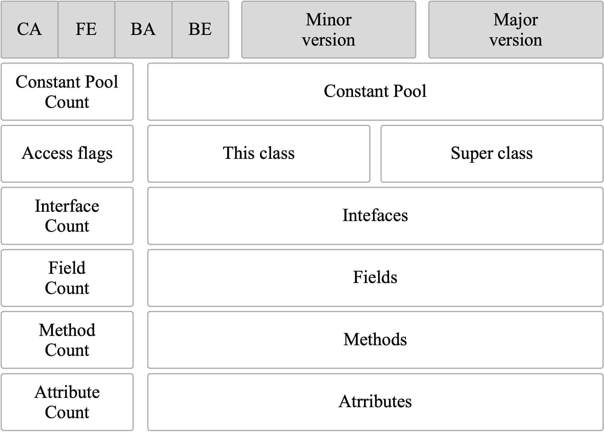

- 字节码
  是jvm能够跨平台，跨语言的根本设计
  
- Class文件结构
  Java 虚拟机规范，Class 文件通过 ClassFile 定义，有点类似 C 语言的结构体
  ClassFile文件结构如下
  ```cpp
  //u4表示4个字节，u2表示2个字节
  ClassFile {
      u4             magic; //Class 文件的标志
      u2             minor_version;//Class 的小版本号
      u2             major_version;//Class 的大版本号
      u2             constant_pool_count;//常量池的数量
      cp_info        constant_pool[constant_pool_count-1];//常量池
      u2             access_flags;//Class 的访问标记
      u2             this_class;//当前类
      u2             super_class;//父类
      u2             interfaces_count;//接口
      u2             interfaces[interfaces_count];//一个类可以实现多个接口
      u2             fields_count;//Class 文件的字段属性
      field_info     fields[fields_count];//一个类可以有多个字段
      u2             methods_count;//Class 文件的方法数量
      method_info    methods[methods_count];//一个类可以有个多个方法
      u2             attributes_count;//此类的属性表中的属性数
      attribute_info attributes[attributes_count];//属性表集合
  }
  ```
   
  Class文件结构主要部分
  1. 魔数(Magic Number)
  每个 Class 文件的头 4 个字节称为魔数（Magic Number）,它的唯一作用是确定这个文件是否为一个能被虚拟机接收的 Class 文件。
  程序设计者很多时候都喜欢用一些特殊的数字表示固定的文件类型或者其它特殊的含义。
  2. Class 文件版本号（Minor&Major Version）
  第 5 和第 6 位是次版本号，
  第 7 和第 8 位是主版本号。
  
  javap -v 命令可以快速查看 Class 文件的版本号信息。
  3. 常量池（Constant Pool）
  4. 访问标志(Access Flags)
  保证兼容性
  高版本虚拟机可以执行低版本的class文件，但低版本虚拟机不支持执行高版本的class文件。
  
  idea插件
  IDEA 插件 jclasslib 查看的，你可以更直观看到 Class 文件结构。
  ((62a5a802-1f28-4408-a904-fb87427f26e8))
-
-