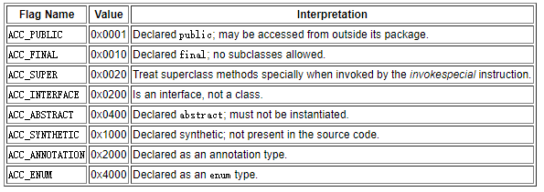
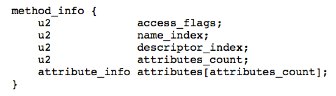

- 字节码
  是jvm能够跨平台，跨语言的根本设计
  
- Class文件结构
  Java 虚拟机规范，Class 文件通过 ClassFile 定义，有点类似 C 语言的结构体
  ClassFile文件结构如下
  ```cpp
  //u4表示4个字节，u2表示2个字节
  ClassFile {
      u4             magic; //Class 文件的标志
      u2             minor_version;//Class 的小版本号
      u2             major_version;//Class 的大版本号
      u2             constant_pool_count;//常量池的数量
      cp_info        constant_pool[constant_pool_count-1];//常量池
      u2             access_flags;//Class 的访问标记
      u2             this_class;//当前类
      u2             super_class;//父类
      u2             interfaces_count;//接口
      u2             interfaces[interfaces_count];//一个类可以实现多个接口
      u2             fields_count;//Class 文件的字段属性
      field_info     fields[fields_count];//一个类可以有多个字段
      u2             methods_count;//Class 文件的方法数量
      method_info    methods[methods_count];//一个类可以有个多个方法
      u2             attributes_count;//此类的属性表中的属性数
      attribute_info attributes[attributes_count];//属性表集合
  }
  ```
   
  Class文件结构主要部分
	- 1. 魔数(Magic Number)
	  每个 Class 文件的头 4 个字节称为魔数（Magic Number）,它的唯一作用是确定这个文件是否为一个能被虚拟机接收的 Class 文件。
	  程序设计者很多时候都喜欢用一些特殊的数字表示固定的文件类型或者其它特殊的含义。
	- 2. Class 文件版本号（Minor&Major Version）
	  第 5 和第 6 位是次版本号，
	  第 7 和第 8 位是主版本号。
	  保证兼容性
	  高版本虚拟机可以执行低版本的class文件，但低版本虚拟机不支持执行高版本的class文件。
	  javap -v 命令可以快速查看 Class 文件的版本号信息。
	- 3. 常量池（Constant Pool）
	  常量池的数量是 constant_pool_count-1
	  （常量池计数器是从 1 开始计数的，将第 0 项常量空出来是有特殊考虑的，索引值为 0 代表“不引用任何一个常量池项”）
	  通过jclasslib查看class文件即可手动验证。
	  常量池主要存放两大常量：字面量和符号引用
	  字面量：接近Java语言层面的的常量概念，如文本字符串、声明为 final 的常量值等
	  符号引用：属于编译原理方面的概念，主要有下面三类
	  a. 类和接口的全限定名
	  b. 字段的名称和描述符
	  c. 方法的名称和描述符
	  常量池中每一项常量都是一个表，这 14 种表有一个共同的特点：开始的第一位是一个 u1 类型的标志位 -tag 来标识常量的类型，代表当前这个常量属于哪种常量类型．
	   
	  .class 文件可以通过javap -v class类名 指令来看一下其常量池中的信息(javap -v class类名-> temp.txt ：将结果输出到 temp.txt 文件)
	- 4. 访问标志(Access Flags)
	  使用二进制标志位方式表示多个访问标志
	  这个标志用于识别一些类或者接口层次的访问信息，包括：这个 Class 是类还是接口，是否为 public 或者 abstract 类型，如果是类的话是否声明为 final
	  类访问和属性修饰符
	  
	  例如0x0021就表示public和ACC_SUPER两种访问标志
	- 5. 当前类（This Class）、父类（Super Class）、接口（Interfaces）索引集合
	  ```
	      u2             this_class;//当前类
	      u2             super_class;//父类
	      u2             interfaces_count;//接口
	      u2             interfaces[interfaces_count];//一个类可以实现多个接口
	  ```
	  类索引用于确定这个类的全限定名
	  父类索引用于确定这个类的父类的全限定名，java单继承，除了Object都有父类
	  接口索引集合用来描述这个类实现了那些接口，接口顺序从左到右排列在接口索引集合中
	- 6. 字段表集合（Fields）
	  字段表（field info）用于描述接口或类中声明的变量。
	  字段包括类级变量以及实例变量，但不包括在方法内部声明的局部变量。
	  field info(字段表) 的结构:
	  
	  access_flags: 字段的作用域（public ,private,protected修饰符），是实例变量还是类变量（static修饰符）,可否被序列化（transient 修饰符）,可变性（final）,可见性（volatile 修饰符，是否强制从主内存读写）。
	  name_index: 对常量池的引用，表示的字段的名称；
	  descriptor_index: 对常量池的引用，表示字段和方法的描述符；
	  attributes_count: 一个字段还会拥有一些额外的属性，attributes_count 存放属性的个数；
	  attributes[attributes_count]: 存放具体属性具体内容。
	  
	  而字段叫什么名字、字段被定义为什么数据类型这些都是无法固定的，只能引用常量池中常量来描述
	  
	  字段的 access_flag 的取值:采用标志位方式
	  
	- 7. 方法表集合（Methods）
	  Class 文件存储格式中对方法的描述与对字段的描述几乎采用了完全一致的方式。
	  method_info(方法表的) 结构:
	  
	  方法表的 access_flag 取值：采用标志位方式
	  
	  
	  注意方法表集合和字段表acceee_flag值的区别
	  因为volatile修饰符和transient修饰符不可以修饰方法，所以方法表的访问标志中没有这两个对应的标志，
	  但是增加了synchronized、native、abstract等关键字修饰方法，所以也就多了这些关键字对应的标志。
	-
	- #
	- 8. 属性表集合（Attributes）
	- idea插件
	  IDEA 插件 jclasslib 查看的，你可以更直观看到 Class 文件结构。
	  ((62a5a802-1f28-4408-a904-fb87427f26e8))
-
-