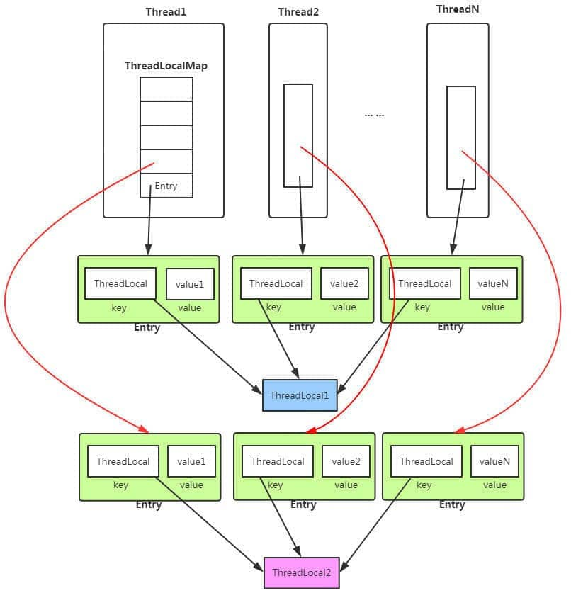

- 不在并发包之列，提供了思路
  ((6299c26b-666a-4ac1-9ec4-0ddf6b9b2033)) 
  每个线程都绑定自己专属的变量，这样就不存在多线程访问共享变量。
- ThreadLocal
  ThreadLocal
	- 背景知识:
	  四大引用类型 ((6299ed85-5fab-4abb-ad7e-d901f1d30469))
	- 实现原理
	  ThreadLocal和ThreadLocalMap,以及线程Thread的关系图
	  
	  如果这张图看懂了，就不必往下看下了
	  1.ThreadLocal的set方法变量存放到哪儿去了?
	  参见Thread的set方法源代码
	  ```java
	  	public void set(T value) {
	          Thread t = Thread.currentThread();
	          ThreadLocalMap map = getMap(t);
	          if (map != null)
	              map.set(this, value);
	          else
	              createMap(t, value);
	      }
	  	ThreadLocalMap getMap(Thread t) {
	          return t.threadLocals;
	      }
	  
	  	static class ThreadLocalMap {
	  		//存储ThreadLocal中存储的变量列表
	  		private Entry[] table;
	  
	  		/**
	  		* 以ThreadLocal变量为key
	  		* Entry的get()调用父类Reference的get()方法
	      	*/
	          static class Entry extends WeakReference<ThreadLocal<?>> {
	              /** The value associated with this ThreadLocal. */
	              Object value;
	  
	              Entry(ThreadLocal<?> k, Object v) {
	                  super(k);
	                  value = v;
	              }
	          }
	  	}
	  ```
	  而Thread类上有ThreadLocal.ThreadLocalMap变量
	  ```java
	  public
	  class Thread implements Runnable {	
	  /* ThreadLocal values pertaining to this thread. This map is maintained
	       * by the ThreadLocal class. */
	      ThreadLocal.ThreadLocalMap threadLocals = null;
	  
	      /*
	       * InheritableThreadLocal values pertaining to this thread. This map is
	       * maintained by the InheritableThreadLocal class.
	       */
	      ThreadLocal.ThreadLocalMap inheritableThreadLocals = null;
	  }
	  ```
	  ThreadLocal的set方法将变量存储到Thread上的ThreadLocal.ThreadLocalMap变量的Entry数组当去中,
	  Entry是以ThreadLocal以自己this为key(是个弱引用类型WeakReference),变量为值
	  Thread--->ThreadLocal.ThreadLocalMap--->ThreadLocal.ThreadLocalMap.Entry.
	  ThreadLocal get,set方法最终调用的ThreadLocalMap的get，set方法
	  原理更深入理解TODO
	  基于ThreadLocalMap的数据结构和源码理解
	  [万字解析 ThreadLocal 关键字](https://javaguide.cn/java/concurrent/threadlocal.html#%E5%89%8D%E8%A8%80)
	- 缺点
	- ThreadLocal内存泄漏问题
	  ThreadLocalMap 的数组Entry类使用的 key 为 ThreadLocal 的弱引用,而 value 是强引用。
	  ThreadLocal的变量是存储在Thread身上(ThreadLocalMap threadLocals变量)，
	  如果线程一直不会回收的话(比如常见的线程池模式下),Thread也不会被销毁，value指向的对象也就一直存在引用链,不会被消除。
	  ThreadLocalMap.Entry的get方法调用的是WeakReference的get方法，而该方法返回值可能为null,当弱引用ThreadLocal被回收时。
	  这种value对象越来越多,就可能存在内存泄漏风险.
	- ThreadLocal官方使用建议
	  使用完ThreadLocal后finally方法调用remove方法清理掉ThreadLocal为key的value。
	-
-
- InheritableThreadLocal
- netty的FastThreadLocal
- 阿里巴巴的包TransmittableThreadLocal
  TTL：TransmittableThreadLocal，ITL：InheritableThreadLocal
  TTL是用来解决ITL解决不了的问题而诞生的，所以TTL一定是支持父线程的本地变量传递给子线程这种基本操作的，ITL也可以做到，
  但是前面有讲过，ITL在线程池的模式下，就没办法再正确传递了，所以TTL做出的改进就是即便是在线程池模式下，也可以很好的将父线程本地变量传递下去。