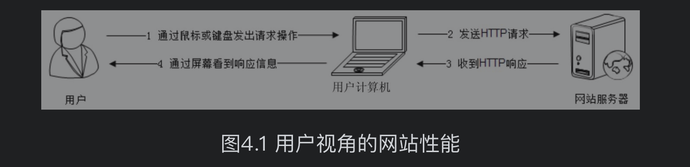
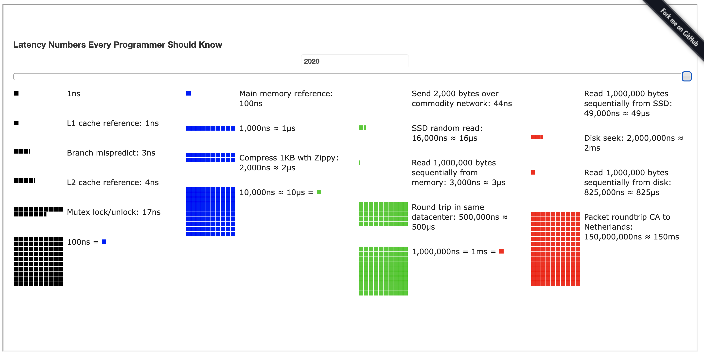
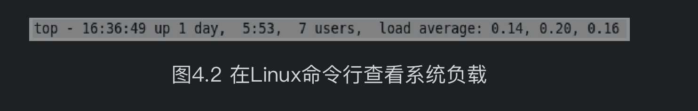

- 网站性能测试
  性能测试是性能优化的前提和基础，也是性能优化结果的检查和度量标准。不同视角下的网站性能有不同的标准，也有不同的优化手段。
	- 不同视角下的网站性能
	  软件工程师说到网站性能的时候，通常和用户说的不一样。
		- 1.用户视角的网站性能
		  从用户角度，网站性能就是用户在浏览器上直观感受到的网站响应速度快还是慢。用户感受到的时间，包括用户计算机和网站服务器通信的时间、网站服务器处理的时间、用户计算机浏览器构造请求解析响应数据的时间，如图4.1所示。
		  
		  不同计算机的性能差异，不同浏览器解析HTML速度的差异，不同网络运营商提供的互联网宽带服务的差异，这些差异最终导致用户感受到的响应延迟可能会远远大于网站服务器处理请求需要的时间。
		  
		  在实践中，使用一些前端架构优化手段，通过优化页面HTML式样、利用浏览器端的并发和异步特性、调整浏览器缓存策略、使用CDN服务、反向代理等手段，使浏览器尽快地显示用户感兴趣的内容、尽可能近地获取页面内容，即使不优化应用程序和架构，也可以很大程度地改善用户视角下的网站性能。
		- 2.开发人员视角的网站性能
		  开发人员关注的主要是应用程序本身及其相关子系统的性能，包括响应延迟、系统吞吐量、并发处理能力、系统稳定性等技术指标。主要的优化手段有使用缓存加速数据读取，使用集群提高吞吐能力，使用异步消息加快请求响应及实现削峰，使用代码优化手段改善程序性能。
		- 3.运维人员视角的网站性能
		  运维人员更关注基础设施性能和资源利用率，如网络运营商的带宽能力、服务器硬件的配置、数据中心网络架构、服务器和网络带宽的资源利用率等。主要优化手段有建设优化骨干网、使用高性价比定制服务器、利用虚拟化技术优化资源利用等。
- 性能测试指标
  不同视角下有不同的性能标准，不同的标准有不同的性能测试指标，从开发和测试人员的视角，网站性能测试的主要指标有响应时间、并发数、吞吐量、性能计数器等。
	- 1.响应时间
	  指应用执行一个操作需要的时间，包括从发出请求开始到收到最后响应数据所需要的时间。响应时间是系统最重要的性能指标，直观地反映了系统的“快慢”。表4.1列出了一些常用的系统操作需要的响应时间。
	  [有意思的网站:查询各个年份一些常用操作的响应时间](https://colin-scott.github.io/personal_website/research/interactive_latency.html)
	  
	  测试程序通过模拟应用程序，记录收到响应和发出请求之间的时间差来计算系统响应时间。但是记录及获取系统时间这个操作也需要花费一定的时间，如果测试目标操作本身需要花费的时间极少，比如几微秒，那么测试程序就无法测试得到系统的响应时间。实践中通常采用的办法是重复请求，比如一个请求操作重复执行一万次，测试一万次执行需要的总响应时间之和，然后除以一万，得到单次请求的响应时间。
	- 2.并发数
	  指系统能够同时处理请求的数目，这个数字也反映了系统的负载特性。对于网站而言，并发数即网站并发用户数，指同时提交请求的用户数目。
	  
	  与网站并发用户数相对应的还有网站在线用户数（当前登录网站的用户总数）和网站系统用户数（可能访问系统的总用户数，对多数网站而言就是注册用户数）。其数量比较关系为：
	  网站系统用户数>>网站在线用户数>>网站并发用户数
	  
	  在网站产品设计初期，产品经理和运营人员就需要规划不同发展阶段的网站系统用户数，并以此为基础，根据产品特性和运营手段，推算在线用户数和并发用户数。这些指标将成为系统非功能设计的重要依据。
	  
	  现实中，经常看到某些网站，特别是电商类网站，市场推广人员兴致勃勃地打广告打折促销，用户兴致勃勃地去抢购，结果活动刚一开始，就因为并发用户数超过网站最大负载而响应缓慢，急性子的用户不停刷新浏览器，导致系统并发数更高，最后以服务器系统崩溃，用户浏览器显示“Service is too busy”而告终。出现这种情况，有可能是网站技术准备不充分导致，也有可能是运营人员错误地评估并发用户数导致。
	  
	  测试程序通过多线程模拟并发用户的办法来测试系统的并发处理能力，为了真实模拟用户行为，测试程序并不是启动多线程然后不停地发送请求，而是在两次请求之间加入一个随机等待时间，这个时间被称作思考时间。
	- 3.吞吐量
	  指单位时间内系统处理的请求数量，体现系统的整体处理能力。对于网站，可以用“请求数/秒”或是“页面数/秒”来衡量，也可以用“访问人数/天”或是“处理的业务数/小时”等来衡量。
	  TPS（每秒事务数）是吞吐量的一个常用量化指标，
	  此外还有HPS（每秒HTTP请求数）、
	  QPS（每秒查询数）等。
	  
	  在系统并发数由小逐渐增大的过程中（这个过程也伴随着服务器系统资源消耗逐渐增大），系统吞吐量先是逐渐增加，达到一个极限后，随着并发数的增加反而下降，达到系统崩溃点后，系统资源耗尽，吞吐量为零。
	  
	  而这个过程中，响应时间则是先保持小幅上升，到达吞吐量极限后，快速上升，到达系统崩溃点后，系统失去响应。系统吞吐量、系统并发数及响应时间之间的关系将在本章后面内容中介绍。
	  
	  系统吞吐量和系统并发数，以及响应时间的关系可以形象地理解为高速公路的通行状况：
	  a.吞吐量是每天通过收费站的车辆数目（可以换算成收费站收取的高速费），
	  b.并发数是高速公路上的正在行驶的车辆数目，
	  c.响应时间是车速。
	  车辆很少时，车速很快，但是收到的高速费也相应较少；随着高速公路上车辆数目的增多，车速略受影响，但是收到的高速费增加很快；随着车辆的继续增加，车速变得越来越慢，高速公路越来越堵，收费不增反降；如果车流量继续增加，超过某个极限后，任何偶然因素都会导致高速全部瘫痪，车走不动，费当然也收不着，而高速公路成了停车场（资源耗尽）。
	  
	  网站性能优化的目的，除了改善用户体验的响应时间，还要尽量提高系统吞吐量，最大限度利用服务器资源。
	- 4.性能计数器
	  它是描述服务器或操作系统性能的一些数据指标。包括System Load、对象与线程数、内存使用、CPU使用、磁盘与网络I/O等指标。这些指标也是系统监控的重要参数，对这些指标设置报警阈值，当监控系统发现性能计数器超过阈值时，就向运维和开发人员报警，及时发现处理系统异常。
	  
	  
	-
	-